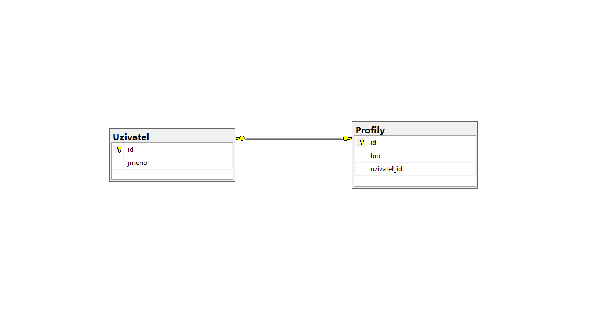
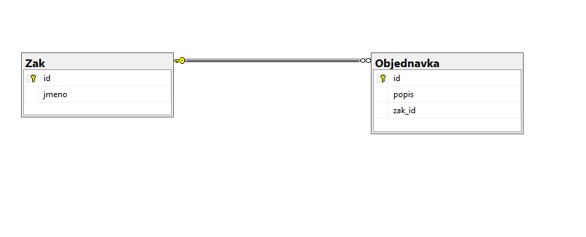
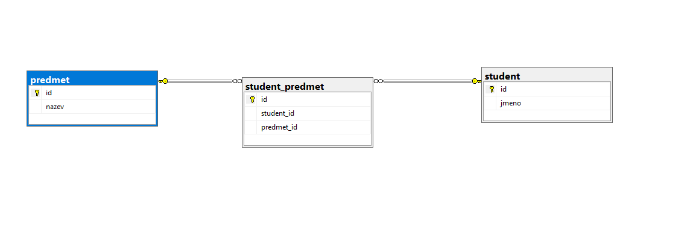

# Relační databázové systémy - popis architektury klient-server, komponenty a jejich činnost, multitasking, rozdíl mezi relačním a nerelačním DBS, porovnání struktury a způsob ukládání

## Architektura klient-server u db

- **Klient** 
  - jedná se o aplikaci (např. webový prohlížeč, mobilní aplikace) kterou používá uživatel
  - sám o sobě žádná data neukládá, pouze posílá požadavky (např. SQL dotazy) a zorazuje výsledky uživateli
- **Server**
  - Databázový server
  - Výkonný počítač, na kterém běží DBMS (Database managment system)
  - Přijímá dotazy od od klientů a zpracovává je, stará se o bezpečnost a posílá zpět odpovědi

#### Výhody

- Data jsou centralizovaná na jednom bezpečném místě, k jedné databázi může přistupovat spousta různých aplikací současně

## Komponenty db systémů a jejich činnost

- Databáze (Samotné úložiště)
  - Fyzické místo, kde leží informace, skládá se z:
    - Dat: Samotné hodnoty (např. "Jan", "Novák", 25) samy o sobě bez kontextu
    - **Metadat**: Data o datech, dodávají informacím smysl a strukturu 
      - Podobné jako katalogizační lístek v knihovně (data o původu a umístění knihy)
      - např. sloupec 1 = Jmeno (varchar), Sloupec 2 = Prijmeni (varchar), Sloupec...
      - Dále např datum pořizení, název autora atd...
- DBMS (Datbase Managment System)
  - Software, který se stará o db
  - Uživatel nesahá nikdy přímo na disk, vždy se musí zeptat DBMS
  - Hlavní činnosti:
    - CRUD Operace - základní práce s daty (Create, Read, Update, Delete)
    - Řizení přístupu (práva)
    - Zálohování a obnova
    - Optimalizace

## Multitasking a Transakce

- Situace, kdy s databází komunikuje více uživatelů najednou, k tomu slouží vlákna a transakce
  - **Transkace**
    - logická jednotka práce, musí se provést celá nebo vůbec
    - př. Převod peněz z účtu A na účet B
    - Zamykají data, při manipulaci s tabulkou


## Relační vs Nerelační (noSQL) databáze. Porovnání struktur.

- **Relační**
  - Data se ukládají strukturovaných tabulek
  - Tabulky jsou mezi sebou propojeny vazbami za pomocí klíčů
  - Data dodržují všechny 3 Normální Formy
  - MySQL, MSSQL, Oracle
- **Nerelační**
  - Data se ukládájí jako dokumenty (např. JSON)
  - Každý záznam může mít úplně jiné atributy
  - Obrovská rychlost, škálovatelnost
  - MongoDB, Cassandra


## Vazby

#### 1:1
```SQL
create table Uzivatel(
id int not null identity(1,1) primary key,
jmeno varchar(20)
)

create table Profily(
id int not null identity(1,1) primary key,
bio varchar(400),
uzivatel_id int unique,

foreign key (uzivatel_id) references uzivatel(id)
) 
```



#### 1:N
```SQL
create table Zak(
id int not null identity(1,1) primary key,
jmeno varchar(20)
)

create table Objednavka(
id int not null identity(1,1) primary key,
popis varchar(200),
zak_id int,

foreign key (zak_id) references Zak(id)
)
```

- M:N
```SQL
create table student(
id int not null identity(1,1) primary key,
jmeno varchar(50)
)

create table predmet(
id int not null identity(1,1) primary key,
nazev varchar(40)
)

create table student_predmet(
id int not null identity(1,1) primary key,
student_id int,
predmet_id int,

foreign key (student_id) references student(id),
foreign key (predmet_id) references predmet(id)
)
```
