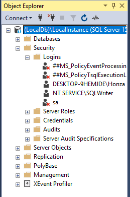
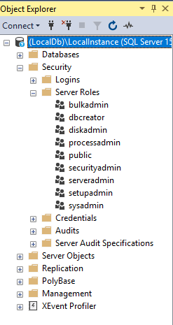
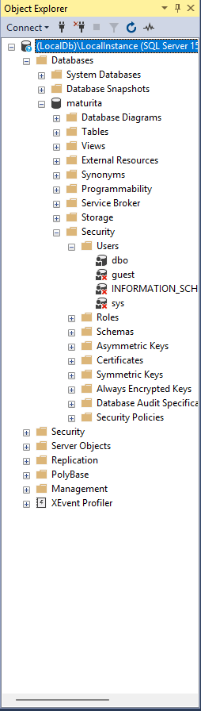

# Bezpečnost databázového systému - autentizace a autorizace, serverové vs databázové role, přidělení/odebrání práv, jazyk SQL-DCL příkazy, porovnání zajištění bezpečnosti na Microsoft SQL Serveru a MySQL Serveru

## Úvod do bezpečnosti databázových systému
- Zabezpečení db je kritické
- Víceúrovňový proces, jehož primárním cílem je zamezit neoprávněnému přístupu k systému a zabránit zneužití, úniku či modifikaci citlivých dat.
- Rozdělen do dvou logických fází
- Autentizace (Ověření identity)
- Autorizace (Ověření oprávnění)

## Autentizace (1. stupeň zabezpeení)
- Odpovídá na otázku (Kdo jsi?)
- Jedná se o proces ověření identity uživatele při pokusu o přístup k samoté db
- V MSSQL se pro tento účel vytváří entita login
- Server typicky nabízí 2 typy autentizace:
  - **Windows Autentizace** 
    - Tento přístup deleguje ověření identity na os
    - Je považován za bezpečnější metodu
    - Jelikož hesla nejsou v db, využívají se bez. domény
    - SQL Syntax: `CREATE LOGIN <username> FROM WINDOWS`
  - SQL server autentizace
    - Metoda podporována napříč platformami
    - Ověřování lokálně pomocí jména a hesla přímo v systému db
    - SQL Syntaxe: `CREATE LOGIN <username> WITH PASSWORD = 'PASSWORD'`

## Autorizace (2. stupeň zabezpečení)
- Odopovídá na otázku (Co smíš)
- Nastupuje ve chvíli, kdy byl uživatel úspěšně přihlášen
- Definuje jeho přístup ke konkrétním db objektům
- Vztah Login a User
  - Aby mohl Login pracovat v konkrétní db, musí mu být v této db vytvořena entita User
  - Jeden Login může být namapován na nula až mnoho Userů v různých DB
  - SQL Syntaxe: `CREATE USER jmeno FOR LOGIN jmeno_loginu`

#### Serverové přihlášení

## Koncept rolí: Serverové vs Databázové (Model MSSQL)
- Role představují pojmenovaný "suobor práv"
- Slouží k efektivní hromadné správě uživ. oprávnění
- Microsoft SQL Server striktně rozlišuje dvě různé úrovně rolí
  - A) Serverové role (Server role)
    - Běžný uživatel po přihlášení automaticky spadá do vychozí role public
    - Umožňuje pouze základní připojení
    - SysAdmin: Nejvyšší administrativní role s neomezeným přístupem
    - DBCreator: Role s oprávněním vytvářet, měnit, mazat restartovat db
  - B) Databázové role (Database role)
    - Tato práva se vztahují výhradně na jednu konkrétní db (lokální dosah)
    - Výchozí role public
    - Systém nabízí přednastavené role, do kterých se uživ. přiřazují
      - db_datareader: uživatel má oprávnění číst data ze všech tabulek v db (ekvivalent příakzu SELECT)
      - db_datawriter: Uživatel smí data tabulek zapisovat (`Insert`,`Update`,`Delete`)
- Pricnip delegování práv:
  - Z hlediska bezpečnosti platí, že uživatel může přidělovat práva dalším osobám pouze směrem dolů
  - Pokud má uživatel pouze právo číst a zapisovat, nemůže vytvořit právo k mazání objektů atd...

#### Serverové role

#### Databázové role

## Jazyk SQL-DCL (Data Control Language)
- K samotnému přidělování a odebírání práv na úrovni jednotlivých objektů (tabulek, pohledů)
- **GRANT** (Udělení): Přiděluje konkrétní oprávnění uživateli či roli (`GRANT SELECT ON tabulka TO uzivatel`)
- **REVOKE** (Odebrání): Odebírá dříve udělené oprávnění. Vrací stav do neutrální pozice
- **DENY** (Odepření): (Specifikum MSSQL) Slouží explicitnímu zákazu. Má absolutní prioritu a přebíjí dříve udělený GRANT

## Architektonické porovnání: MSSQL vs MySQL Server
- Cíle bezpečnosti stejné, systém se liší ve filozofii uspořádání účtů:
  - Microsoft SQL Server: 
    - Využívá dvojstupňoví přístup
    - Odděluje tím serverovou a databázavou vrstvu (Entita `Login` -> Entita `User`)
  - MySQL Server
    - Tento systém konceptu zjednodušuje a používá pouze jedinou identitu globálního uživatele (User)
    - (Např. ROOT_Honza@localhost)
      - Tento uživatel má práva definována ve dvou rovinách
        - Administrative roles: Globální oprávnění pro správu celého serveru
        - Schema Privileges: Oprávnění vztažená na konkrétní schéma/databázi (Admin zde může velmi granulárně přidělit práva jako INSERT či SELECT nad konkrétními db)