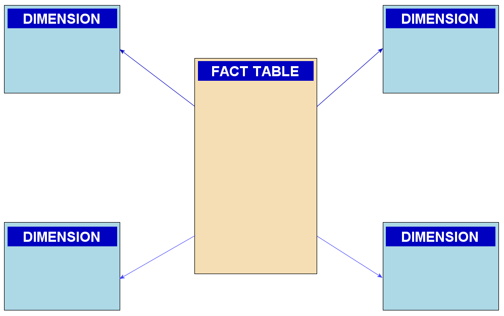
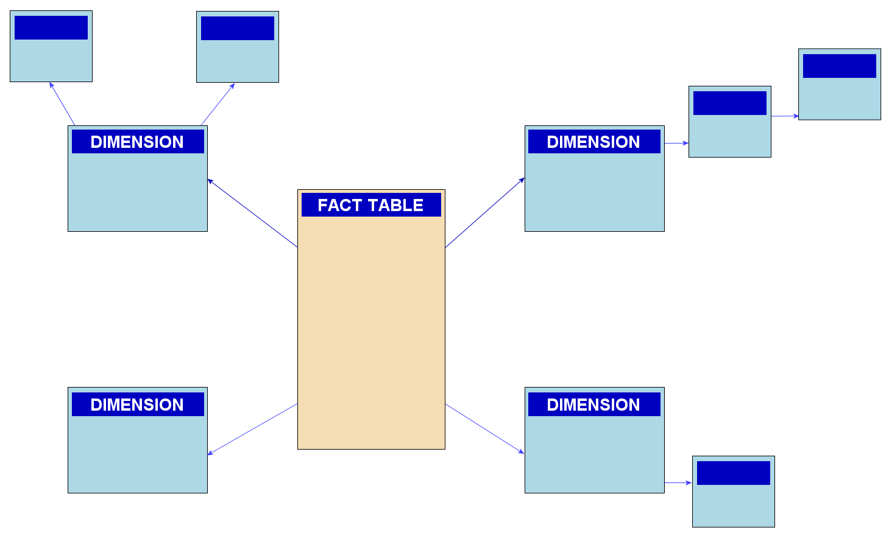

# Datové sklady - struktura, důvody použití, rozdíl od běžné databáze, popis a rozdíl schémat Star/Snowflake, OLTP/OLAP význam

## Architektura a Historizace dat (Proč nestačí běžná DB)
- Běžná db řeší aktuální stav
- Pokud se např. zákazník "Jan Novák" přestěhuje z Prahy do Brna, v běžné db jeho adresu přepíšeme pomocí UPDATE
- Tím ovšem ztratím historii
- **Historizace** (SCD Slowly Changing Dimenstions)
  - V datovém skladu data nepřepisujeme, ale vytvoříme nový záznam
  - Datový sklad si pamatuje, že od roku 2020 do 2023 bydlel Jan v Praze (Vážou se k tomu tehdejší záznamy) a od roku 2024 bydlí v Brně
  - To je klíčové pro manažerský reporting, jinak by se nám změnila historická statistika regionů
- **Datová tržiště** (Data Marts)
  - Je často obrovský (např terabyty dat)
  - Aby se v tom analytici neztratili, vytvářejí se z hlavního skladu tzv. Datové tržiště
  - Výsek dat pro jedno oddělení
  - např. Marketingové oddělení dostane jen data o kampaních a prodejích, ale neuvidí složitá data z personálního oddělení

## Koncept OLAP a Datové kostky (Data cube)
- OLAP se nedívá na data jako na ploché tabulky, ale jako vícerozměrovou kostku
- Rubiková kostka, kdy každá její hrana představuje jinou demnzi
- Uvnitř kostiček jsou uložená čísla (fakta)
- Analytik ti pak s touto kostkou může dělat specifické operace
  - **Drill-down** (Zanoření)
    - Manažer vidí celkové tržby za rok 2023
    - Klikne na ně a zanoří se na jednotlivé čtvrtletí
    - Pak na měsíce atd...
    - **Jde od obecného do detailu**
  - **Roll-Up** (Srolování)
    - Opačný proces oproti Drill-Down
    - Z denních tržeb si nechá data agregovat do ročního přehledu
  - **Slicing & Dicing** (Krájení na plátky)
    - Manažer si z celé kostky "ukrojí" jen jeden plátek
    - Např. chce vidět prodeje všech produktů ve všech časech, ale pouze pro lokalitu Praha

## Star DB vs Snowflake DB
- Příklad:
- Tabulka dimenze s názvem: **Produkt**
  - Máme 100000 produktů
  - Každý patří do nějaké kategorie / podkategorie
- **Star DB** (Denormalizované - rychlé, ale plýtvá místem)
  - Vytvoříme jedinou obrovskou tabulku `DIM_Produkt`
  - Budou v ní sloupce: `IP_Produkt`, `Nazev`, `Kategorie`, `Podkategorie`
  - Problém: Text 'Elektronika' se ve sloupci Kategorie bude fyzicky opakovat 10 000krát pro každý kabel a televizi, plýtváme místem na disku
  - Výhoda: Když analytik hledá elektroniku, db přečte jen jednu tabulku. Je to bleskě rychlé

- Příklad: (Star)
  - `DIM_produkt`
    - `ID_produkt`
    - `Nazev`
    - `Kategorie`
    - `Vyrobce`
    - `Zeme_puvodu`

- **Snowflake DB** (Normalizované - šetří místo, ale je pomalejší)
  - Tabulku rozbijeme, vytvoříme `DIM_Produkt`, tabulku `DIM_Kategorie` a tabulku `DIM_Podkategorie`
  - Slovo "Elektronika" je v db uloženo jen jednou a tabulky se na něj odkazují pomocí cizího klíče (ID)
  - Výhoda: Ušetříme mnoho místa na disku
  - Problém: Když se analytik zeptá na prodeje elektroniky, db musí provést operace JOIN přes tři tabulky, než se vůbec dostane k číslum
  - Dotaz trvá mnohem déle

- Příklad: (Snowflake)
  - `DIM_Produkt`:
    - `table_product`: (`ID_produkt`,`ID_vyrobce`,`Nazev`)
    - `table_vyrobce`: (`ID_vyrobce`, `Nazev`, `ID_zeme`)
    - `table_zeme`: (`ID_Zeme`, `Nazev`)

- V praxi se dnes mnohem častěji používá Star db
- Uložný prostor je dnes levnější než čas manažerů a analytiků
- Rychlost > Úspory