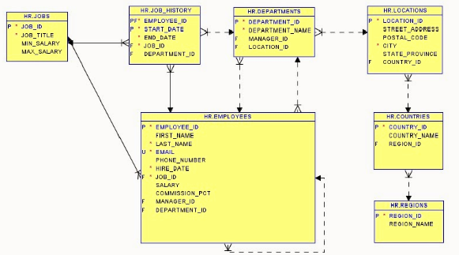
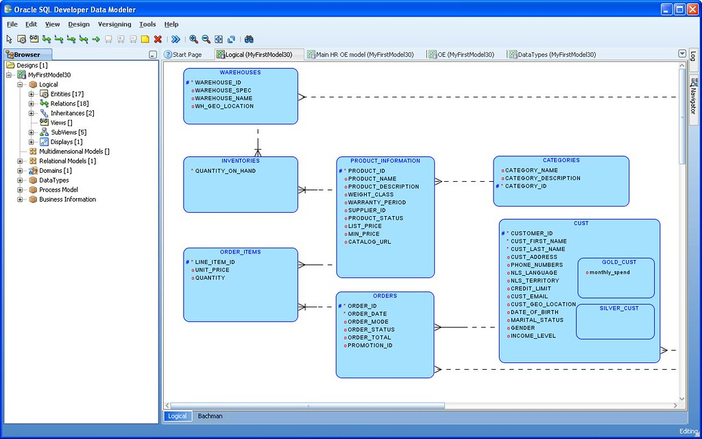
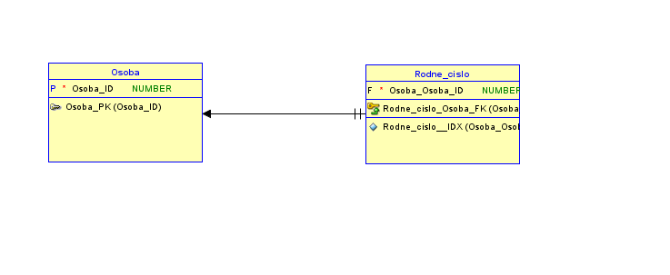
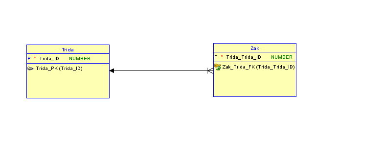
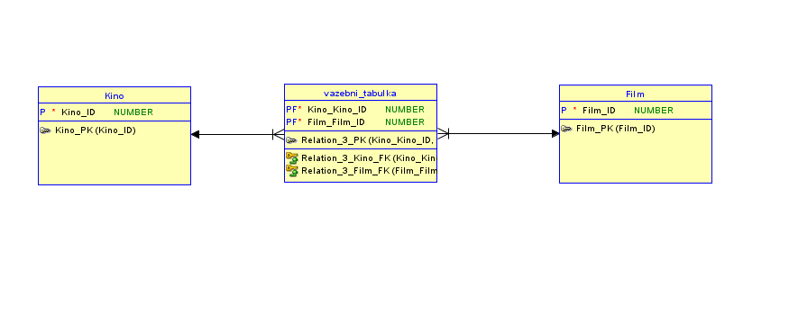
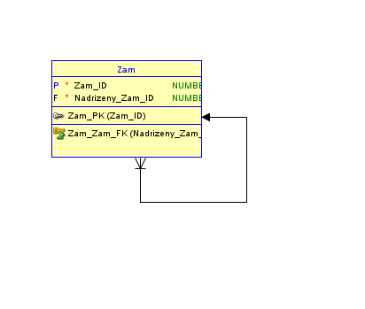
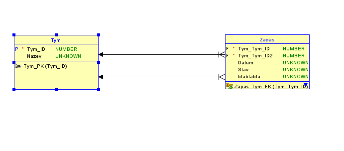
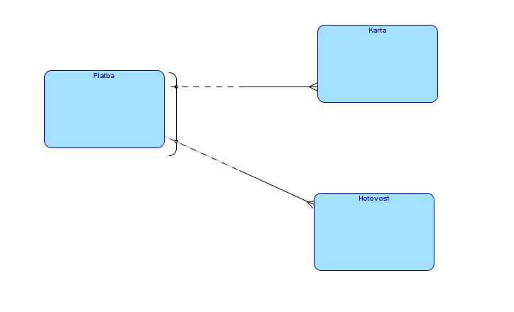
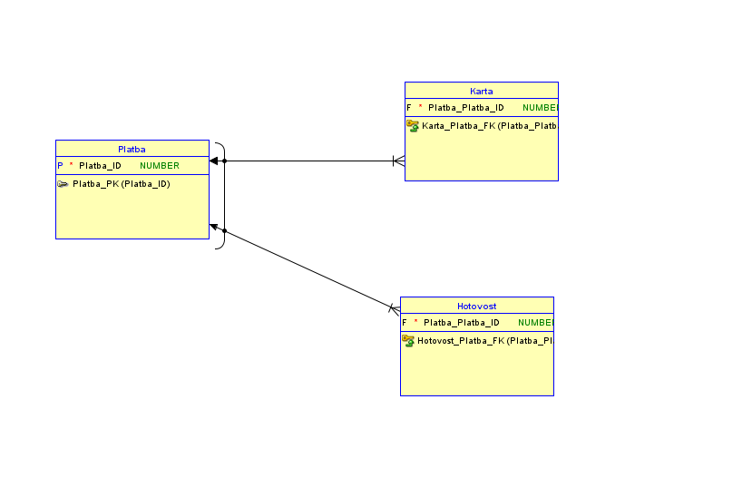
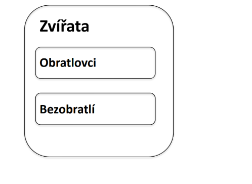

# Modelování relační databáze - základní pojmy a terminologie, konceptuální vs relační model, identifikace vztahů, konvence ER diagramu v prostředí Oracle DataModeler

---

## Základní pojmy
- **Entita**: Je to "třída objektů" zastupující nějaký reálný objekt, osobu nebo událost. Příklad entity = Student
- **Atribut**: Představuje vlastnost dané entity, neboli sloupec v tabulce, příklad = ID, Jméno, Příjmení
- **Instance**: Konkrétní záznam (Objekt) uvnitř entity, v relační db je to jeden konkrétní řádek v tabulce obsahující reálná data

---

## Konceptuální vs Relační model
#### Konceptuální model
- ER Diagram
- Jsou v něm jen entity a vazby
- Hrubý nákres
- Neřeší se zde dat. typ
- Nijak zásadně se neřeší cizí klíče

#### Relační model
- Logický/Fyzický model
- Nákres přímo db
- Přidávají se dat. typy
- Řeší se cizí klíče
- Velký důraz na to, aby zde nebyla vazba M:N, ta se musí rozdělit na vazební tabulky, 1:N, aby vůbec dávala smysl

---

## Identifikace vztahů a konvence (Oracle DataModeler)
- Vztah mezi entitami se popisuje pomocí **kardinality** a **parciality**

#### Kardinalita
- Určuje kolik instancí z jedné entity může být napojeno na instanci z druhé entity
- Příklady:
  - 1:1 - Osoba a Rodné číslo = Jedna osoba má právě jedno rodné číslo

  - 1:N - Třída a žák = Jedna třída může mít více žáků

  - M:N - Kino a film = V kině se hraje více filmů a film se hraje ve vícero kinech

#### Parcialita
- Určuje povinnost ve vztahu
- O (volitelné) = Znamená to, že instance může, ale nemusí mít vazbu
- | (Povinné) = Znamená to, že instance musí existovat ve vztahu

---
## Speciální případy modelování
- **Self reference**
  - Rekurzivní vztahy
  - Entita má vztah sama na sebe
  - Např. vztah zaměstnanec, nadřízený
  
- **2x 1:N**
  - Záznam historických dat
  - Příklad: Hraje se liga ve fotbale, týmy máme v db pod entitou Tým, každý víkend 2 týmy hrají proti sobě
  - Řešení 2 vazby 1:N
  
- **Arcs**
  - OR / XOR
  - Situace, kdy pro danou instanci může platit jen jeden z několika možných vztahů
  - Příklad: Platba může být zaplacená kartou, hotově
  - **JAK NA TO**
    - Označit hlavní entitu a vazby u možných vztahů, pak se objeví okénko **NEW ARC**
    - V tomto případě označená entita Platba a vazby ke kartě a hotovosti
  
  

- SuperType a SubType
  - **SuperType** např. Rodič
  - **SubType** např. Potomek
  - Supertype obsahuje všechny atributy pro všechny potomky, Subtype zdědí všechny atr. od rodiče, ale přidává si vlastní unikátní atr.
  - Subtype na závislý na něm samotném se značí uprostřed
  