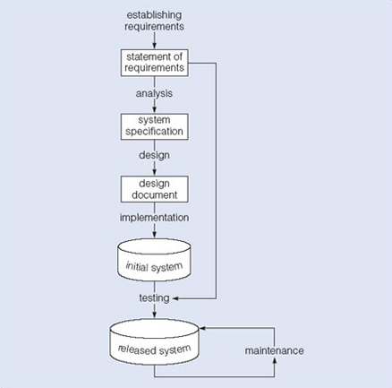

# Etapy vývoje databázových systémů - popis a význam jednotlivých etap, životní cyklus databáze, dokumentace, obsah a forma

## Životní cyklus databáze: Fáze Vzniku (Vývoj)

---

#### Analýza problému (Zjišťování stavu)
- Analýza organizace: 
  - Zkoumání přesně, jak například firma nebo služba funguje.
  - Jaký má Hardware a Software
  - Jak vypadá jejich aktuální DB, jestli nějaká je
- Definování problému
  - Žjišťuje staré problémy s db
  - Případné špatné zabezpeení atd..
- Definování cilů
  - Sepíše s klientem základní požadavky na vstupy a výstupy.
  - Řeší zda bude stačit starou db jen upravit nebo postavit novou
  - Jaká se nataví uživ. práva

---

#### Návrh řešení (Kreslení plánů)
- Jakmile víme co chce klient, můžeme to začít přenášet na papír
- Modelování: 
  - Vytváříš logické a relační schéma.
  - Databázi navrhujeme tak, aby dokázala pojmout všechna požadovaná data
  - Aby db. byla platná
  - Už v návbrhu řešíme integritní omezení a normální formy
- Technické návrhy:
  - Zvolíš vhodný db systém (Oracle, MySQL)
  - Operační systém a Hardware
  - Řeší se i teoretická implementace, kdo bude novou db reálně spravovat

---

#### Implementace (Stavba na serveru)
- **Realizace**:
  - Nainstaluješ strukturu db na vybraný server a provedeš základní optimalizaci 
- **Příprava dat a uživatelů**:
  - Nahraješ do systému testovací data, aby bylo možné systém vyladit.
  - Pokud firma přechází ze starého sys., řeší se import a export dat.
  - Založíš a vyzkoušíš nové uživatelské účty
- **Zálohování**:
  - Už v této fázi se definuje režim záloh

## **Testování**
  - Databáze postavená, ale ještě se nesmí pustit do ostrého provozu
  - Testuje se na výhradně umělých (testovacích )datech!
  - Co se testuje?
    - Rychlost a výkonnost systému
    - Zda db správně hlídá jednoznačné hodnoty (integrita dat)
    - Zda fungují výstupy
  - Bezpečnost
    - Kontrolují se přístupy, loginy a hesla. Aplikuje se pravidlo, že uživatelská práva musí být omezena na absolutní minimum
  - Záchrana dat
    - Simuluje se výpadek a zkouší se obnova ze zálohy a transakčních logů
  - Kontrolní smyčka
    - Pokud se najdou chyby, vývoj se vrací zpět do fáze návrhu a úprav.
    - Pokud chyby nejsou, db přechází do ostrého provozu

## Životní cyklus databáze: Fáze provozu

#### Operování (Běžný provoz)
- Databáze běží naostro s reálnými daty a zaměstnanci v ní běžně pracují
- Běží automatické zálohování a nasbíraná data se případně využívají k "data miningu"

#### Údržba (Servis)
- Žádný systém nevydží beze změny
- Během provozu se mohou požadovat změny, nebo firma zavede nějaké nové provozní podmínky
- V tu chvíli proběhně fáze údržby a po přidání veškerých novinek se vrací zpět do běžného operačního stavu

## Dokumentace databázového systému
- Vývojář nikdy nevytváří databázi jen pro sebe
- Pokud by odešel, bez dokumntace by byl systém neudržitelnej

- Co dokumentace obsahuje?
  - Schémeta (Fyzické ER, a relační modely)
  - Datový slovník (Data Dictionary): Tabulka, která vysvětluje každý atr.
  - Bezpečnostní matici: Kdo má jaké role a k čemu má přístup
  - Provozní řád: Krok za krokem popsaný zálohování a plán obnovy
  - Dokumentace může být například interaktivní HTML (jako dokuemntace u Pythonu třeba)

## Začátek životního cyklu databáze
- Analýzou problému
- Neexistuje žádný kód ani tabulka nové db
- Zjištují se požadavky a nároky na sw s hw

## Konec životního cyklu
- Nahrazení novým systémem (Začne nový životní cyklus nové db)
- Ukončení potřeby
- ...