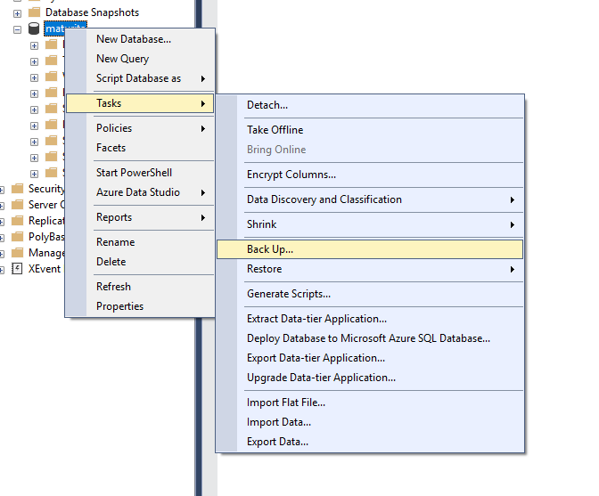
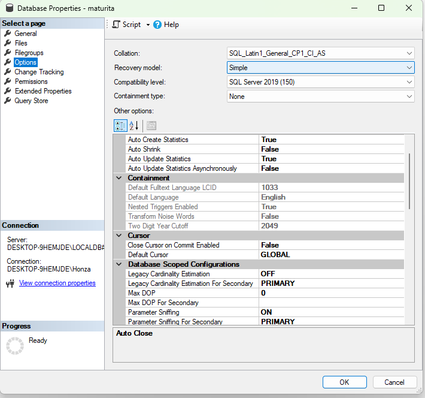

# Zálohování a archivace dat - typy záloh, příklad vytvoření zálohy, obnova dat, rozdíl mezi zálohou a archivací, typy souborů pro archivaci, důvody zálohování vs archivace

## Filozofický rozdíl: Záloha vs Archiv
- Záloha slouží k  záchraně pi havarii
- Archiv slouží k uvolnění místa a splnění zákonných povinností

#### Zálohování (Backup)
- Účel = Rychlá obnova po havárii hw nebo lidské chybě
- Čas = Ukládá se na krátkou dobu
- Přístup = Data jsou vysoce frekventovaná a musí být okamžitě dostupná pro znovunačtní
- Formát: Aktuální formát daného SQL serveru, který je optimalizovaný pro rychlost

#### Archivace (Archive)
- Účel = Dlouhodobé uchovávání historických dat (např. faktury stálé 10 let), které v db jen překážejí a zpomalují ji
- Čas = Ukládá se na velmi dlouho dobu (např. 10 a více let)
- Univerzální formáty: SQl Skripty, CSV, XML, JSON

## Typy Zálohy:
- Full Backup (Úplná záloha):
  - Záloha úplně všeho
  - Každá záloha musí začít úplně plnou zálohou
  - Výhoda: O nic nepříjdeme
  - Nevýhoda: Trvá dlouho a zabírá moc místá, takže nemusí být příliš efektivní

- Differential Backup (Diferenciální záloha):
  - Ukládá jen to, co se změnilo od poslední zálohy
  - Pokud v neděli uděláme full backup a v pondělí diff, uloží se jen záloha za 1 den a pokud v úterý, udělá se záloha za 2 dny

- Incremental Backup (Přírůstková záloha)
  - Ukládá změny jen od poslední jakékoli zálohy
  - Šetří nejvíc místa, ale obnova je nejsložitější

#### Transakční log
- Soubor, kam si databáze zapisuje každý SQL příkaz (INSERT, UPDATE, DELETE) předtím než ho fyzicky dá do tabulky
- Srdce každé pokročilé db
- Dva modely, které musím popsat
  - Simple Recovery Model (Jednoduchý):
    - Transakční log se samostatně nezálohuje a po zapsání do DB se promazává
    - Obnova: Možná jen do času poslední zálohy (Full nebo Diff)
    - Pokud server spadne v 15:00 a poslední záloha byla v 10:00, 5 hodin práce je navždy pryč
  - Full Recovery Model (Úplný):
    - Log se samostatně zálohuje často, někdy i každých 15 minut
    - Obnova: Umožňuje tzv. **Point-in-time recovery**, může db spravit přesně do sekundy, než někdo omylem udělal chybu

## Strategie zálohování (Plánování)
- Strategie není jenom o tom udělat kopii
- Musí definovat kdo je zodpovědný za obnovu
- Jak často se zálohy testují
- Kde se média fyzicky nachází kvůli bezpečnosti

Příklad týdenního plánu

<table>
  <thead>
    <tr>
      <th>Den</th>
      <th>Typ zálohy</th>
      <th>Čas</th>
      <th>Poznámka</th>
    </tr>
  </thead>
  <tbody>
    <tr>
      <td><strong>Neděle</strong></td>
      <td><strong>Full Backup</strong></td>
      <td>22:00</td>
      <td>Nejdůležitější záloha týdne</td>
    </tr>
    <tr>
      <td><strong>Pondělí - Sobota</strong></td>
      <td><strong>Diff. Backup</strong></td>
      <td>22:00</td>
      <td>Rychlé uložení denních změn</td>
    </tr>
    <tr>
      <td><strong>Každou hodinu</strong></td>
      <td><strong>Log Backup</strong></td>
      <td>Průběžně</td>
      <td>Ochrana před ztrátou dat během dne</td>
    </tr>
  </tbody>
</table>

