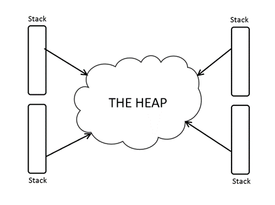
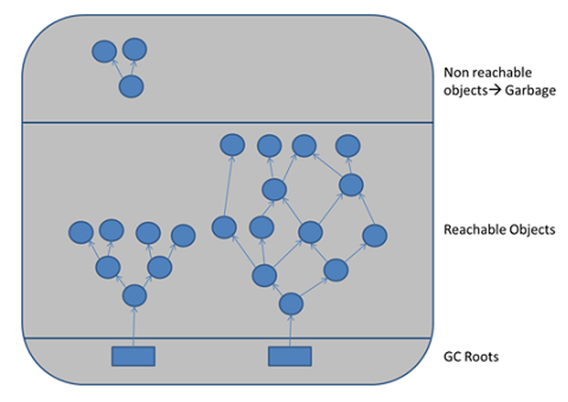
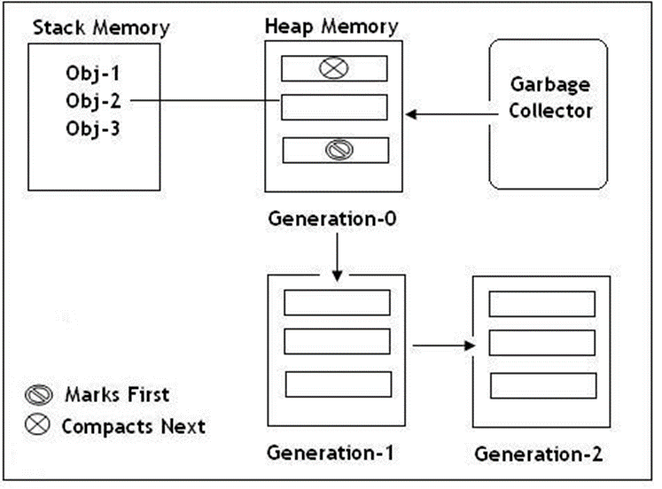

# [Adresování a správa paměti - Garbage collecting, Reference/ukazatele, Struktura paměti programu](https://youtu.be/zhQXxuwxqek?si=Eietvsgz-LvIm1e4)
## O čem mluvit?
- Reference a Ukazatele
  - [Reference](https://docs.oracle.com/javase/7/docs/api/java/lang/ref/Reference.html) - Odkazuje na **objekt na heapu**
  - [Ukazatel](https://cw.fel.cvut.cz/old/_media/courses/a7b36pjc/prednasky/pjc-4-ukazatele.pdf) - Odkazuje **na místo v paměti** (u [low-level programming languages](https://web.archive.org/web/20241214053921/https://www.cs.mtsu.edu/~xyang/2170/computerLanguages.html))
- Struktura paměti programu
  - [Heap](https://ksp.mff.cuni.cz/encyklopedie/halda-a-cesty/)
    - je jeden
    - **Obsahuje referenční data** (třída, enum, string, interface)
    - **Zabírá největší část RAMky**
    - **Ukládá všechny objekty, které se během vývoje vytváří a také objekty, které vlákna sdílejí**
  - [Stack](https://cw.fel.cvut.cz/old/_media/courses/x33dsp/dsp-p2.pdf)
    - Každé vlákno má svůj
    - **Ukládají se zde primitivní data** (int, char, bool, byte)
    - Proměnné z metod patří sem
    - **Funguje na principu LIFO**
- Správa paměti programu
  - [Garbage collector](https://docs.oracle.com/en/java/javase/21/gctuning/garbage-first-g1-garbage-collector1.html#GUID-0394E76A-1A8F-425E-A0D0-B48A3DC82B42)
  - GEN 0,1,2
    - Proces, ve kterém **se zbavujeme nepotřebných dat zabírající místo v paměti**
    - Pouze v **High-Level programming languages**
    - **Důležité pojmy**
      - Nepoužívaný objekt - **Nemá** na sobě **žádnou referenci**
      - Používaný objekt - Objekt, na který **je reference či pointer**

## Reference a Pointer
#### Reference
- Odkaz na proměnou nebo instanci objektu na haldě
  - Nemůže odkazovat na NULL (jak kde)
- Samotná reference se ukládá ve Stacku (zásobníku)
- Abstraktní datový typ
- Abstraktnější variantou ukazatele, ukazatel nemá žádnou informaci o objektu v operační paměti
- Zvyšuje flexibilitu
- Snadnější sdílení mezi kódem

**Python**:
```
# CODE HERE
exampleObject = ExampleClass(); # exampleObject je reference
exampleString = "example"; # exampleString je reference
```

#### Pointer
- Odkaz na adresu (místo) proměnné
- Datový typ
- Může odkazovat na null
- Uložení adresy v paměti počítače
- Zpřístupnění dat, která jsou uložena na adrese v operační paměti
- Dělí se na typy ukazatelů:
  - **Blízký ukazatel**
    - Lineární adresa (offset)
    - Neobsahuje identifikační číslo segmentu
  - **Vzdálený ukazatel**
    - Lineární adresa (offset)
    - Obsahuje identifikační číslo segmentu
- V C# se moc nepoužívá, ale existuje
- V Pythonu neexistuje
- Více využití má v low-level programming languages (např. C)
- **C**
```
-----------------
int x = 10;
int *uk = &x; // Ukazatel odkazuje na adresu x
*uk = 20; // Změna hodnoty x pomocí ukazatele
```

## Struktura paměti
#### Heap (Halda)
- Je pouze jedna v celém programu
- Na haldu se ukládají všechny referenční typy
  - třída, interface, delegát, enum, objekt a **string**
- Není organizovaná
- Je přístupná pro všechny
  - (Pokud instanci nezablokujeme modifikátorem přístupu - public, private, internal, protected)
- Pokud jsou na haldě nějaká data, na která neukazuje žádná proměnná, smaže je **Garbage Collector** 

#### Stack (Zásobník)
- Druh paměti, který vlákna využívají pro provedení kódu
  - Každé vlákno má vlastní zásobník
- Je setříděný (LIFO)
- Každá metoda je vlastní blok, kde jsou uložená její data, bloky jsou vrstveny na sobě takovým způsobem, že nové přidáné bloky padají na starší a tím zabraňují práci s těmi předešlými, dokud nejsou vyřešeny
- Obsahuje pouze primitivní datové typy metod
  - int, float, char, bool, byte, double
- Proměnné volané v metodách, se také ukládají na zásoník, jsou ale nepřístupné, jakmile metoda skončí, smažou se
- Pokud je práce s pamětovým blokem ukončena, tak je i s daty smazán
  - (Není ve skutečnosti, ale časem přepsán jiným blokem. Úplně stejně to funguje všude v PC)


#### Příklady
**Python**:
```
class Example:
    def __init__(self):
        self.a = 0 # int
        self.b = False # bool (v pythonu podtřída int)
        
    def example_method(self):
        c = 0.0 # float
```
- Proměnné **a**, **b** jsou atributy instance Example, tudíž leží na Heapu, **c** jsou ale proměnná metody, v pythonu sice leží na Heapu, ale její reference existuje v rámci lokálního rozsahu (Stack frame)


## Garbage Collector
- Automatizována správa paměti na haldě
- Uvolňuje nepoužívanou paměť
  - Prochází haldu a maže objekty bez reference
- Zajišťuje aby programu nedošla paměť
- Může mít negativní dopad na výkon
- Spouští se automaticky, ale může být zavolán uživatelem **gc.collect()** (Pro Pythone)
- Objekty se rozdělují na živé a mrtvé
  - Živé objekty si **GC** vkládá do grafu podobnému stromu (který se ale cyklí)
    - Objekty je živý do té doby, dokud se používá
    - Objekty mimo strom jsou odpad odsouzen k zániku
- Rozděluje paměť v haldě do 3 kategorií **Generation 0, Generation 1, Generation 2**

Python:
```
import gc

gc.collect() # Spustí GC ručně

gc.disable() # Vypne GC

gc.enable() # Zapne GC
```



#### Generation 0
- Každá proměnná začíná zde
- Místo, kde se nacházejí právě vytvořené objekty (Objekty s krátkou životností)
- Toto místo je čištěno nejčastěji
  - Je to rychlá operace
- Patří sem nejčastěji dočasné proměnné (např. v metodě)
- Pokud je místo plné, **GC** ho pročistí, a ty které nesmaže, jsou přesunuty do GEN 1

#### Generation 1
- Obsahuje krátkodobé objekty a slouží jako vyrovnávací paměť mezi krátkodobé a dlouhodobé objekty
- **GC** se zde spouští oproti **GEN 0** méně častěji
- opět: Pokud je místo plné, **GC** ho pročistí, a ty které nesmaže, jsou přesunuty do GEN 2

#### Generation 2
- Obsahuje objekty s dlouhodobou živostností
  - Ty zde obvykle žijí po celý chod programu
  - Jedná se například o objetky vytvořené pro statické členy nebo globální proměnné
- Místo kde **GC** zasahuje ze všech nejméně
- Pokud je místo plné **GC** spustí čistku v **GEN 2** poté **GEN 1** a nakonec v **GEN 0**, pokud i tak není nikdo místo, vyhodí **OutOfMemoery** chybu

