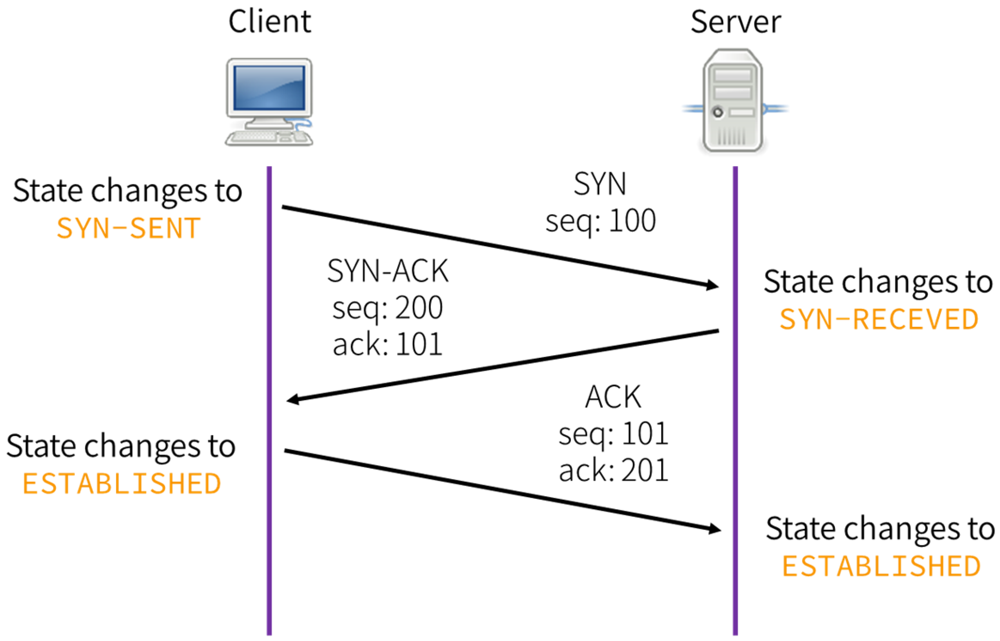
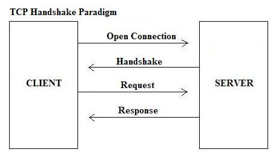
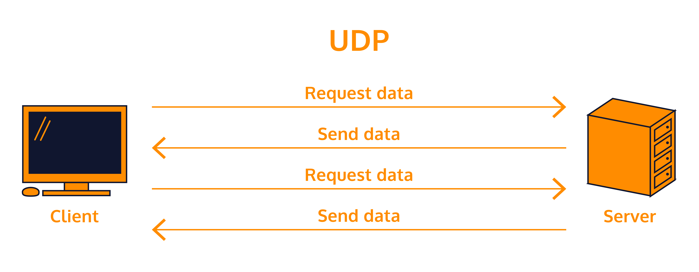

from http.client import responses

# [Komunikace v síti - tvorba síťových aplikací, Berkley socket a jeho rozhraní](https://youtu.be/RHb8T_lhIR4?list=PLmW7bUCTvOeTSag9ZZBYXdHs_iEwB4OHM)
*Tady Manďa těžce doporučoval nezklouznout k PSS, je to furt matura o programování, ne o PSS*

## O čem mluvit?
- Protokol
  - Díky ním komunikujeme přes síť
  - TCP
    - Spolehlivý
    - Packety na sebe čekají
    - 3way handsake
    - WWW, Email, HTTP
  - UDP
    - Nespolehlivé
    - Chrlí
    - Videostream, voip, online hry
    - HTTP
      - Typy requestů
    - CRUD
    - Posílání dokumentů
- [Client / Server]
- Popsat tvorbu síťových aplikací 
- Barckley socket
  - Built in v každém unixovém systému včetně windows
    - Standart pro komunikaci v sítije to API přes které komunikuje
  - Socket, bind, listen, connect, send, recv, write, read

## Komunikace v síti
- Komunikace v síti probíhá díky protokolům
- Probíhá díky nim výměna informací (dat)
  - např. mezi klienty, mezi klienty a serverem

## Transmission Control Protocol (TCP)
- Nejpoužívanější protokol *(Čtvrté transpontní vrstvy OSI)*
- Garantuje spolehlivé doručení dat a to i ve správném pořadí
  - Posílá packety a ověřuje jestli dorazili, pokud ne, pošle je znova
- Použitím TCP mohou aplikace na počítačích propojených do sítí vytvořit mezi sebou spojení
  - Přes to mohou obousměrně přenášet data
- TCP také umožňuje rozlišovat a rozdělovat data pro více aplikací (Například webový server a emailové servery) běžících na stejným počítači
- Používán skoro všude:
  - WWW, E-mailu, SSH, ...


#### Navázání spojení
Probíhá ve třech krocích **(3-way handshake)**
- Klient odešle na server datagram s nastaveným příznakem SYNC
- A náhodně vygenerovaným pořadovým číslem (x), potvrzovací číslo = 0
- Server odešle klientovi datagram s nastavenými příznaky SYNC a ACKNOWLEDGMENT, potvrzovací číslo = x+1, pořadové číslo je náhodně vygenerované (y)
- Klient odešle datagram s nastaveným příznakem ACK, pořadové číslo=x+1, číslo odpovědi = y+1.



- Obě strany si pamatují pořadové číslo vlastní i protistrany
- Používají se totiž i pro další komunikaci a určují pořadí paketů
- Když úspěšně proběhne handshake, je spojení navázáno a zůstane tak až do ukončení spojení



#### Ukončení spojení
Probíhá podobně jako jeho navázání. Používá se k tomu příznaků FIN a ACK:
- Strana, která nechce posílat další data, odešle datagram s nastaveným příznakem FIN
- Protistrana odpoví datagramem s nastaveným příznakem ACK s potvrzovacím číslem o jedničku větším, než bylo pořadové číslo v datagramu s příznakem FIN (jako kdyby protistrana poslal místo FIN jeden byt)
- Druhá strana, která ukončuje posílání dat, odešle datagram s nastaveným příznakem FIN
- Protistrana odpoví datagramem s nastaveným příznakem ACK

.jpg)

Po prvních dvou krocích může druhá strana pokračovat v posílání dat. Pokud žádná data posílat nebude, mohou být kroky 2 a 3 sloučeny. Teprve po těchto čtyřech krocích je spojení ukončeno.

[SOCKET DOCS](https://docs.python.org/3/library/socket.html#socket.socket)
- VYBORNA, UPLNE DOLE CELEJ KOD pro listener

#### Příklad

Server:
```python
import socket

HOST = '127.0.0.1'
PORT = 8080
with socket.socket(socket.AF_INET, socket.SOCK_STREAM) as server_listener:
    server_listener.bind((HOST, PORT))
    server_listener.listen()
    conn, add = server_listener.accept()
    with conn:
        print(f"Connected on address: {add}")
        while True:
            data = conn.recv(1024)
            if not data:
                break
            conn.sendall()
```

Klient:
```python
import socket

HOST = '127.0.0.1'
PORT = 8080

with socket.socket(socket.AF_INET, socket.SOCK_STREAM) as client_socket:
    client_socket.connect((HOST,PORT))
    
    message = "Hello server"
    client_socket.sendall(message.encode())
    print(f"Sent: {message}")

    response = client_socket.recv(1024)
    print(f"Received {response.decode()}")
```

## User Datagram Protocol (UDP)
- Založený na posílání nezávislých zpráv
- Nezachovává pořadí paketů - prostě to "chrlí"
  - Když se jeden paket ztratí, nic se neděje
- Rychlejší než TCP
- Nespolehlivé doručování

Vhodný pro malé aplikace a aplikace pracující systémem otázka-odpověď
- Např.
  - DNS
  - Stream videa, VOIP
  - Online hry
  - Jeho bezstavovost je užitečná pro servery, které obsluhují mnoho klientů nebo pro nasazení kde se počítá se ztrátami datagramů a není vhodné, aby se ztrácel čas novým odesíláním (starých) nedoručených zpráv (např. VoIP, online hry).



#### Příklad
Python:
Server:
```python
import socket

HOST = '127.0.0.1'
PORT = 8080

# Create a UDP socket
with socket.socket(socket.AF_INET, socket.SOCK_DGRAM) as server_socket:
    server_socket.bind((HOST, PORT))
    print("Server is listening on port: ", PORT)
    
    while True:
        data, add = server_socket.recvfrom(1024)
        print(f"Received from {add} : {data.decode()}")
        server_socket.sendto(data.upper(), add)
```

Klient:
```python
import socket

HOST = '127.0.0.1'
PORT = 8080

# Create a UDP socket
with socket.socket(socket.AF_INET, socket.SOCK_DGRAM) as client_socket:
    message = "Hello server"
    client_socket.sendto(message.encode(), (HOST, PORT))
    print("Sent: ", message)

    response, serv_add = client_socket.recvfrom(1024)
    print("Received from server: ", response.decode())
```

Rozdíly mezi TCP a UDP
TCP je spojově orientovaný protokol což znamená, že k navázání "end-to-end" komunikace potřebuje, aby proběhl mezi klientem a serverem tzv. "handshaking". Poté, co bylo spojení navázáno, data mohou být posílána oběma směry. Charakteristické vlastnosti TCP protokolu jsou:

- Spolehlivost - TCP používá potvrzování o přijetí, opětované posílání a překročení časového limitu. Pokud se jakákoliv data ztratí po cestě, server si je opětovně vyžádá. U TCP nejsou žádná ztracená data, jen pokud několikrát po sobě vyprší časový limit, tak je celé spojení ukončeno
- Zachování pořadí - Pokud pakety dorazí ve špatném pořadí, TCP vrstva příjemce se postará o to, aby se některé data podržela a finálně je předala správně seřazená.
- Vyšší režie - TCP protokol potřebuje např. tři pakety pro otevření spojení, umožňuje to však zaručit spolehlivost celého spojení.

UDP je jednodušší protokol založený na odesílání nezávislých zpráv. Charakteristika protokolu:

- Bez záruky - Protokol neumožňuje ověřit, jestli data došla zamýšlenému příijemci. Datagram se může po cestě ztratit. UDP nemá žádné potvrzení, přeposílání ani časové limity. V případě potřeby musí uvedené problémy řešit vyšší vrstva.
- Nezachovává pořadí - Při odeslání dvou zpráv jednomu příjemci nelze předvídat, v jakém pořadí budou doručeny.
- Jednoduchost - Nižší režie než u TCP (Není zde řazení, žádné sledování spojení atd.)

## Hyper Text Transfer Protocol (HTTP)
- Postavený na protokolu TCP
- Obvykl jsme v roli klienta a komunikujeme se vzdáleným webserverem (nginx, apache)
- Ve většině případů posíláme 2 typy requestů, a to POST a GET
- Využít můžeme například jednoduchou třídu WebClient

#### GET
- Request pomocí URL např. pro ověření konektivity na stránku 'https://w3schools.com' pomocí *get* motedy v pythonu
- V pythonu existuje modul *requests* který se o HTTP requesty stará

Python:
```python
import requests

url = 'https://www.w3schools.com/python/demopage.php'

myobj = {'somekey': 'somevalue'}

x = requests.post(url, json = myobj)

print(x.test)
```

#### Další typy requestů:
- **PUT**
  - Nahraje data na server. Objekt je jméno vytvoření souboru. Používá se velmi zřídka, pro nahrávání dat na server se běžně používá FTP nebo SCP/SSH
- **DELETE**
  - Smaže uvedený objekt ze serveru. K tomu je zapotřebí jistých oprávnění stejně jako u metody PUT.
- **TRACE**
  - Odešle kopii obdrženého požadavku zpět odesílateli, takže klient může zjistit, co na požadavku mění nebo předávájí servery, kterými požadavky prochází.
- **OPTIONS**
  - Dotaz na server, jaké podporuje metody.
- **HEAD**
  - Metoda podobná GET, avšak nepředává data. Poskytne pouze metadata o požadovaném cíli (velikosti, typ, datum změn, ...)

## Další protokoly
- File Transfer Protocol (FTP)
- SSH File Transfer Protocol (SFTP)
- Simple Mail Transfer Protocol (SMTP)

## Tvorba síťových aplikací
K vývoji síťové aplikace, jako např. e-mail, online hra, nejaký FTP server, ..., se musím nejdříve rozhodnout jaký protokol je vhodný pro naší aplikaci. Například UDP na online hru, SMTP na e-mail atd...

Zajistit šifrování a bezpečnost. Např. webovou stránku mít na HTTPS ne HTTP, pokud manipuluje s citlivými daty.

## Berkley Socket
Berkley socket (BSD Socket) poskytuje programátorům sadu/knihovnu funkcí a metod pro vytváření síťových aplikací, jako jsou klient a server. Tyto funkce umožňují programům vytvářet a spravovat síťová spojení, posílat a přijímat data přes sít a manipulovat se síťovými adresami.

Tato technologie byla vyvinuta v Univerzitě v Berkley v 80. letech a stal se de facto standardem pro síťovoou komunikaci UNIXových a UNIX-like operačních systémech. Berkley Socket API je k dispozici v mnoha programovacích jazycích včetně C, C++, Pythonu a dalších. Je základem pro vytváření široké škály síťových aplikací, včetně webových serverů, emailových klientů, online her a mnoho dalších

Aktuálně je implementace BSD socket dostupná v každém moderním operačním systému a jedná se tak o standard v rámci připojování k Internetu.

Výpis funkcí, které nabízí API BSD sockets:

- `socket()` = Vytváří nový socket daného typu, identifikovaný celým číslem, s alokovanými systémovými prostředky.
- `bind()` = Je používán na straně serveru, typicky spojuje lokální port s IP adresou
- `listen()` = Používá strana serveru, uvádí TCP socket do stavu listen
- `connect()` = Používá se na straně klienta a přířazuje volný lokální port k socketu, v případě TCP socketu vytváří nové TCP spojení
- `accept()` = Se používá na straně serveru. Potvrzuje příchozí požadavek na ustavení nového TCP spojení od vzdáleného klienta a vytváří nové TCP spojení
- `send()` a `recv()`, nebo `write()` a `read()`, nebo `sendto()` a `recvfrom()`, se používají pro odesílání a přijímání dat z/na vzdálený socket.  
- `close()` = Požádá systém o uvolněné prostředkŮ, které měl systém alokován, u TCP je spojení přerušeno 
- `gethostbyname()` a `gethostbyaddr()` se používají pro vzájemný překlad jmen hostů a adres. Podporováno je pouze IPv4.
- `select()` je využíván k čekání, než bude socket nebo seznam socketů připraven.
- `poll()` se používá ke kontrole stavu socketu ze skupiny socketů. Skupina může být kontrolována, zda je možné do některého socketu zapsat, číst z něj, nebo zda nenastala nějaká chyba.
- `getsockopt()` umožňuje získat aktuální stav dané vlastnosti socketu.
- `setsockopt()` umožňuje nastavit hodnotu dané vlastnosti socketu.