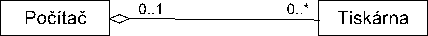
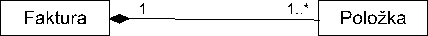

# [Principy objektového programování, agregace a kompozice objektů](https://youtu.be/r1diROtxcpo?si=MQ7B9JLApdrCnfPj)

## O čem mluvit?
- OOP
  - Dědičnost
    - Pro třídy se stejnými/podobnými vlastnostmi
    - Ulehčení práce
    - Např. třída zaměstnanec dědí od třídy člověk
  - Zapouzdření
    - K nějakému kódu se nemůže dostat celý program
    - private, public, protected, internal, static
  - Polyformismus
    - Můžeme tak volat metodu s různými parametry
  - Agregace kompozice
    - Agregace je volná vazba
    - Kompozice není volná, objekty nemohou fungovat bez sebe
  - Interface
    - Používáme když více tříd používá stejnou metodu, v daných třídách ji pak upravujeme


## Objektově orientované programování (OOP)
- Jedno z programovacích paradigmat
  - vzorec / model myšlení
- Silně se odráží od teorie objektů
- Snaha kopírovat svět 1:1
  - Např. Dveře otevíráme stále stejně, nezáleží jestli je na dveřích kukátko, řetízek, jsou bílé nebo hnědé
- Můžeme věci během psaní kódu recyklovat, použít je klidně stokrát znovu, případně je trochu upravit, aby odpovídaly naším potřebám programu *(což vyplívá i z předpokladu nahoře)*

#### Tolerance objektů
- Základní pojem **Třída**
- Pojem třída je **objekt**
  - Objekt je instancí třída
  - Má dva základní "smysly existence":
    - Pamatovat si svůj stav pomocí atr.
    - Poskytovat své metody, aby se dalo s objektem zvnějšku pracovat

# Dědičnost
- Způsob ulehčení si práce s mnoha objekty
- Používáme pro objekty se stejnými vlastnostmi
- Např.: Místo toho, že každou třídu Učitel a Student budeme psát zvlášť, vytvoříme třídu Člověk s vlastnosmi jako např. výška, věk, ..., a třídy Učitel a Student budou pouze dědit od třídy člověk (Nebudeme muset psát vlastnosti výška, věk, ..., několikrát, pouze jednou v člověkovi)
- Nepotřebujeme-li tvořit instance od obecného Člověka, můžeme třídu označit za **abstraktní**, tím se zajistí, že od ní instance vytvořit nelze

#### Metody
- Voláme pomocí tzn. **Tečkové konvence** -> objekt.metoda()
- Dědění metod:
  - Můžeme používat zděděnou metodu
  - Můžeme přepsat metodu pomocí override

Hlavní rozdíl oproti C#, že Python používá dynamické typování, nikoliv statické jako C#
- Python:
```python
class Parent:
    def show(self):
        print("Metoda v rodičovské třídě")

class Children(Parent):
    def show(self):
        print("Metoda v třídě potomka")

obj1 = Parent()
obj1.show()

obj2 = Children()
obj2.show()
```

- Můžeme zanechat název metody, ale změnit vstupní parametry

- Python:
```python
class Suma:
    def count(self, x, y, z=0):
        return x+y+z

    def countAll(self, *args):
        return sum(args)

s = Suma()
print(s.count(10, 20)) # By default Z = 0

print(s.count(10,20,30)) # Setted value Z

print(s.count(10.5,20.5)) # Python doesnt care about int or double

print(s.countAll(1,2,3,4,5,6)) # *args is tuple, Python nahrazuje overloading funkcí "packing", což je zabalení do n-tice (tuple) 
```

#### Rozhraní (interface)
- Používáme když naše (dvě) třídy budou mít stejnou metodu
- Do rozhraní pouze napíšeme hlavičku metod, tak jak odpovídá syntaxi daného jazyka, a po implementování rozhraní do třídy sepíšeme konkrétní implementaci dané metody
- Např.:
  - By dvě třídy pro člověka uměly to samé, ale měly jiné vlastnosti

```python
from abc import ABC, abstractmethod

class IExampleInterface(ABC): # Definice Interface, jako dědící třídu z ABC
    @abstractmethod # Dekorátor abstractmethod vynutí, že potomek MUSÍ tuto metodu přepsat
    def some_method(self):
        pass
    
    @property # Pomocí zkrazky @props se vygeneruje předloha pro getter a setter!!!!!!
    @abstractmethod
    def some_prop(self):
        pass 
    
    @some_prop.setter
    def some_prop(self, value):
        pass

class ExampleClass(IExampleInterface):
    def __init__(self):
        self.some_prop = 0
    
    def some_method(self):
        print("Implementace metody some_metod")

    @property
    def some_prop(self):
        return self.some_prop
    
    @some_prop.setter
    def some_prop(self, value):
        self.some_prop = value

example = ExampleClass()

example.some_method()

example.some_prop = 10

print(example.some_prop)
```

Pro python je nutnost modul Abstract Base Classes (ABC)
- **ABC** (Abstract Base Classes)
  - Pokud by dědící třída neměla nějakou abstractmethod, program by vyhodil error
  - Používá dekorátory
  - Jednoduchá tvorba getteru a setteru pomocí props

#### Polyformismus
Umožňuje: 
- Jednomu objektu volast jednu metodu s různými parametry
- Objektům odvozeným z různých tříd volat tutéž metodu se stejným významem v kontextu jejich třídy, často pomocí rozhraní
- Přetěžování operátorů neboli provedení rozdílné operace v závislosti na typu operandů
- Jedné funkci dovolit pracovat s argumenty různých typů (parametricky polyformismus, ne ve všech prog. jazycích)

#### Zapouzdření
- K proměnným v nějakém objektu se mohou dostat jen blíže specifikované další části programu
- Cílem je, aby při vytvoření objektů, jediné co objekt ukazuje navenek, byly metody a nějaké způsoby komunikace se zbytkem
  - (Getters, Setters, ToString (__str__))
- Úroveň přístupových práv se mohou mezi prog. jazyky lišit

V **Python** pro to používáme:
- **Public** - přístup odkudkoliv, v pythonu všechno
- **Private** - Pouze v rámci třídy, v pythonu se značí pomocí __ (např. __data)
- **Protected** - Pouze v rámci třídy nebo odvozené, v pythonu se značí pomocí _ (např. _data)
- **Static** - *Třídní atribut*, v pythonu deklarujeme pomocí @staticmethod

## Agregace a kompozice
Agregace a komopozice jsou vztahy mezi třídami
- Agregace = sdílená (Shared) agregace
  - Volná vazba mezi celkem a součástí - jeden objekt (celek) využívá služby dalších objektů (součástí)
- Kompozice = složená (composite) agregace
  - Silnější formou agregace
  - Neumožňuje samostatnou existenci součástí

#### Příklady:
- Agregace:
- Vztah mezi počítačem a tiskárnou je vztah typu agregace
  - Kdy počítač s tiskárnou tvoří jeden celek, ale tiskárna může existovat i tehdy, pokud není k žádnému počítači připojena



Kompozice:

