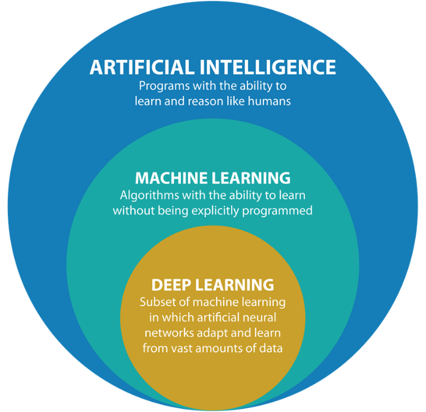
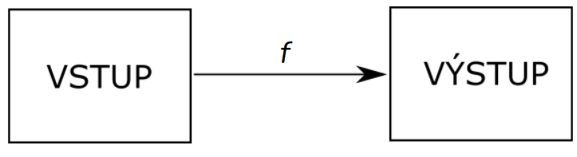

# Strojové učení - Příprava dat, Chyby v datech a bias, Korelace a kauzalita

## O čem mluvit?

- AI
  - Typy: uzká (řešení konkrétní problém), silná (neexistuje, dokáze vše)
  - Využití, problém, ...
- Strojové učení
  - Supervised - Dáváme stroji labeled data, pro vstupní data je správný vstup
  - Unsupervised - data bez označení, ke vstupu není správný vstup
  - Semi-supervised - mix obojího nahoře
  - Reinforcement - Dostává odměny/Trest, ai ve hrách, autopilot, drou?
- Druhy vstupů
  - Klasifikace - dělení dle vstupních rysů
  - Regrese - Číselná hodnota dle vstupu
  - Shlukování - Do skupin dle podobnosti
- Jak se připravují data (Dělali jsme to na hodinách, navíc u projektu)
  - Chyby v datech a čištění
  - Zbavujeme se null, výchylek, zbytečných atr.
  - Omezujeme na nějaký rozptyl
- Bias
  - Ovlivnění výsledků
  - Když dáme modelu data, o drahých autech nebude mít data k těm levným
- Korelace a kauzalita
  - Korelace je když např. žáci mají dobré výsledky a hodně spánku, ale není to zároveň kauzalitou (na to by byl třeba výzkum)
  - Kauzalita je když např. Pití za volantem způsobuje více nehod
  - Pro kauzalitu je potřebná korelace

**Jelikož je to velmi obsáhlé a složité téma, doporučuji se zpětně podívat na úlohy z collabu ve škole a přečíst si 8  o AI, jsou krátké a na jejich koncích bývají otázky o kterých můžete taky mluvit u maturity.**

## Umělá inteligence

Inteligence projevená stroji, jde o adaptaci v novém prostředí, vykonávání úkolů, které by normálně vyžadovali lidskou inteligenci.

Dělíme na dva typy

**Úzká AI (slabá):**

- Vždy řeší jeden konkrétní problém, neumí se adaptovat na nové problémy
- Všechny exisující AI jsou slabou umělou inteligencí

**Obecná AI (silná)**

- Umí cokoliv, co dokáže člověk, nebo dokonce více
- Zatím neexistuje

## Strojové učení

Strojové učení je jedním z nástrojů umělé inteligence. V současnosti nejrozšířenější metoda umělé inteligence s největšími dopady. Strojové učení je podmnožinou umělé inteligence. Zabývá se zjišťováním funkce _f_, která pro nová vstup určí odpovídající výstup.

Zkráceně - nalezne vzor dat, namísto toho aby mu byl přímo tento vzor poskytnut.
Tento vzor - funkce - se pak dále zlepšují pro co největší přesnost výstupu
Příklady dvojic vstupů a výstupů nazýváme _trénovací data_.

Pomocí strojového učení se řeší problémy jako předpověď počasí, ceny, rozpoznání obrázků apod.

### Typy učení:

- **Supervised learning**
- Pro vstupní data je určen správný vstup
- Cílem je aby pochopil data v kontextu
- Data jsou v datasetu určena
  - Např. V tabulce máme označený sloupec jako: cenu, rozlohu, počet pokojů
- **Unsupervised learning**
- Ke vstupním datům není známý vstup
- Cílem je aby našel skryt= nebo nejasné vztahy/vzorce mezi neoznačenými daty
- Data **ne**jsou v datasetu určena
  - Např. V tabulce není označené, je to prostě hromada dat = nachází vztahy mezi daty
- **Semi-supervisied learning**
- Část vstupních dat je se známým výstupem, ale další data, typycky větší, jsou nez něj
- **Reinforcement learning**
- Též učení posilováním, funguje na pricnipu agenta, který integruje s prostředím a za své akce dostává odměnu či trest. Agent se snaží maximalizovat odměnu. .. Umělá inteligence ve hrách samoříditelné drony apod.

### Základní druhy úloh:

- **Klasifikace**
  - Supervised
  - Rozděluje data do dvou nebo několika tříd na základě vstupu
  - Např.: Je to spam email?, Klasifikace obrázků jako kočka nebo pes, diagnostika nemocí na základě zdravotních údajů
- **Regrese**
  - Supervised
  - Odhaduje číselné hodnoty výstupu na základě vstupu
  - Např.: Cena domu
- **Shlukování**
  - Unsupervised
  - Zařazuje objekty do skupin s podobnými vlastnostmi
  - např. Na sociálních sítí

## Příprava dat

Než s daty budeme nějak pracovat, je dobré je vyčistit (sanitizace dat), aby jsme dostali co nejpřesnější výsledky, tato sanitizace obsahuje:

- Co nejvíc zmenšit rozsah dat, např. Mít hodnoty jen od 0 do 1, nepracovat s miliony ale jen s deistkami, atd...
- Zlikvidovat všechny prázdné nebo neuplné záznamy, např. záznam obsahuje hodnotu _null_
- Snažíme se zbavit extrémních výjímek. Snažíme se co nejvíce zúžit rozptyl dat
- Všechny parametry převést do nějakého standardizovaného stavu
- Zbavit se irelevantních atributů
- Atributy v data setu by měli být vyjádřeny pouze čísly

Toto čištění dat se dá dělat ručně, ale při velkém množství vstupních dat je efektivnější data prohledat pomocí kódu, v Pythonu knihovny pandas a NumPy

### Bias

Jedná se o to, že máme nějaký extrém a funkce se podle něho řídí, ale už se odchyluje od reality. Tím pádem máme dobrý model pro testovací data, ale v realitě model nebude zas tak dobrý.

Př. Prodáváme spíše dražší auta takže jsou ceny zaujaté aby byly vyšši, protože v modelu není dostatek levnějších aut, který by výslednou predikci vraceli do normálu a chybu (Bias) zmenšovali. Výsledkem je vyšší odhadovaná cena u levnějších aut.

### Korelace a kauzalita

Korelace neimplikuje kauzalitu. Ale pro kauzalitu je nutná korelace.

Korelace vztah mezi veličinami a procesy. Ve chvíli, kdy dojde ke změně v jedné veci dojde k změně v druhé věci. Jedna veličina nezbytně neovlivňuje veličinu druhou.

V kauzalitě jedna veličina přimo ovlivňuje tu druhou. Protože se změnila jedna věc změní se i druhá.

### Korelace a kauzalita