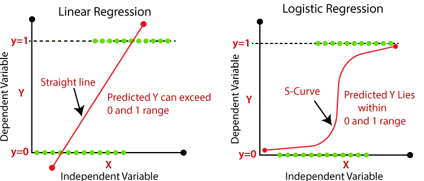
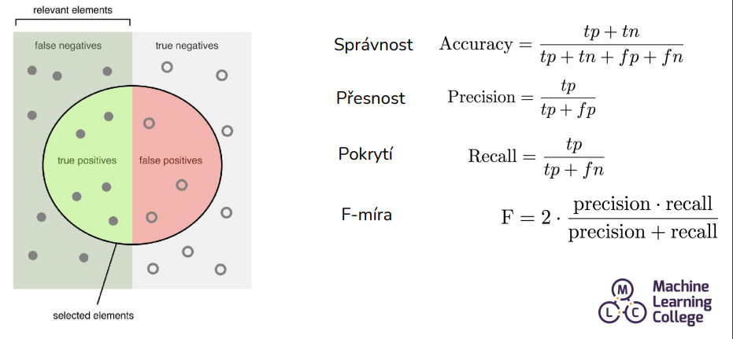

# Strojové učení s využitím regrese a klasifikace

## O čem mluvit?
- Regrese
  - Dám stroji data a chci po něm na výstupu číslo
  - Snažím se vytvořit matematickou funkci, která ke každé hodnotě něco vrátí, (cena, domu, ...)
  - Ukázat její grafek
- Klasifikace
  - Po dání stroji dat po něm chce přesná data
  - Např.: Co je na obrázku za zvíře, jakou má střecha barvu, ...

## Regrese
- Typ řízeného učení, kde je cílem předpovídat výstupní hodnotu na základě vstupních dat
- Obecně je cílem regrese sestavit model, který dokáže přesně předpovědět výstup na základě vstupních hodnot a prozumět základnímu vztahu mezi nimi
  - Např.: Cena nemovitostí, OCR pro čísla [Video na pochopení neuronů](https://youtu.be/aircAruvnKk?si=C9XAgIpqNWmIsXJ3)

- Snažíme se proložit přímku mezi všemi body tak, abychom dospěli k nejmenší odchylce mezi všemi body
- Opíráme se o square errror tedy chybu na druhou z kterých následně uděláme průměr a zjistíme tak chybovost modelu
- Vstupní data by měla být pouze číselné hodnoty

Výsledek lineární regrese je reálné číslo (Hodnota odpovídající hodnotě na výsledné přímce) oboje z sklearn.metrics

[Příklady v Google Colab](https://colab.research.google.com/drive/1mOroDym6F0vWQYk_qWma0j5KsgOQHJas?usp=sharing)

## Klasifikace
- Strojové učení kde se snažíme výstupní data zařadit do předem stanovených skupin / tříd / klasifikací
  - Snažíme se nalézt matematický vztah mezi vstupními hodnotami a výstupními
- Supervised-learning = Model je trénován na označeném datovém souboru, který obsahuje příklady vstupních dat a odpovídajících označení tříd
  - Datové typy ve vstupních datech můžou být různé - Text, Číslo, Logické hodnoty...
- Cílem je naučit model aby zvládl zařadit neznámá/nová data do stanovených skupin správně
- Např.
  - Rozpoznání spamu, co je na obrázku (Kočička/pes/...), diagnostika chorob

*(Pokud si dobře pamatuju tak Mandík chce aby jsme znali ty vzorečky)*

Snažíme se do grafu vložit přímku tak, abych rozdělil co nejlépe dvě množiny prvků, následně pomocí funkce zjistit, do jaké kategorie hledaný prvek patří, jestli do kategorie na jedné straně od přímky nebo na druhé straně.

Výsledek klasifikace je nějaká bude accuracy_score(y_test, y_pred) ... (např. 0.8, 0.9, 1.1) nebo classifiaction_report(y_test, y_pred) ... oboje from sklearn.metrics

[Příklady v Google Colab](https://colab.research.google.com/drive/1J2j72dMF1q0Errgu2RkuMCOZUYoSiIBd?usp=sharing)