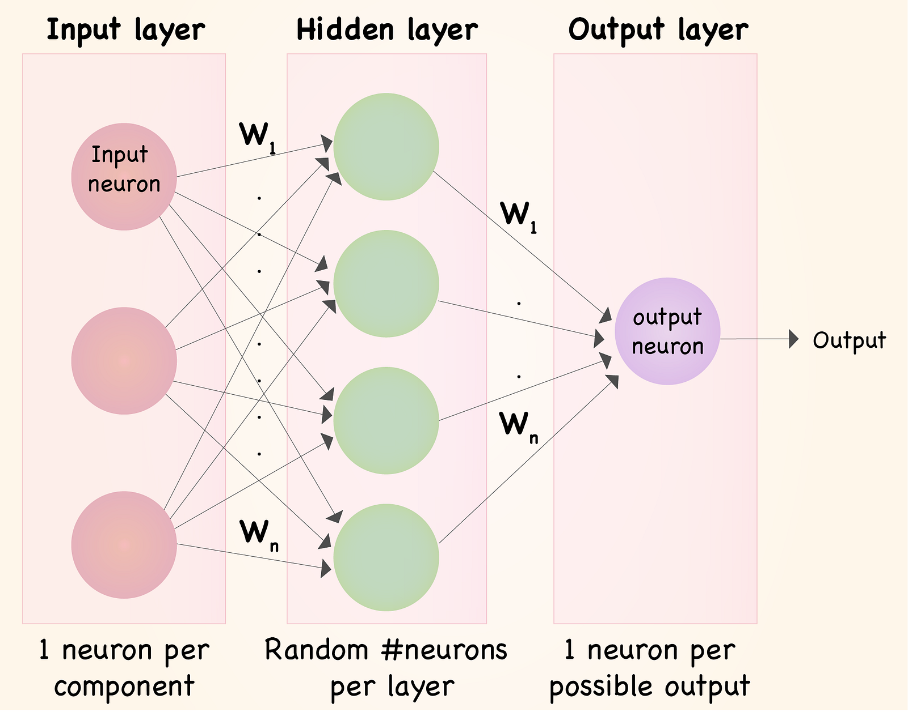
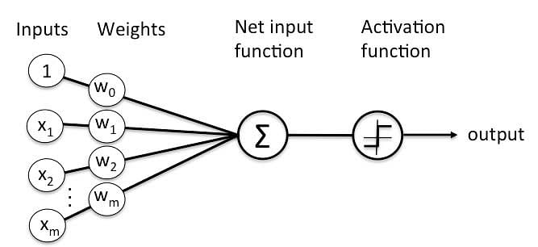

# Strojové učení s využitím umělých neuronových sítí

## O čem mluvit?
- Neuronová síť
  - Vzorem je mozek
  - Struktura pro paralelní zpracování dat
## Neuronová síť
- Jeden z výpočetních modelů v umělé inteligenci
  - Vzorem je mozek a chování neuronů v něm
- Je to strukutra určená pro distribuované paralelní zpracování dat
  - Skládá se z umělých neuronů
- Využívá se hlavně u problémů, co nedokáže vyřešit lineární regrese
- Má vysoké nároky na výpočetní sílu (kvůli tomu se využívá zřídka)

Cílem je nastavit síť tak, aby dávala co nejpřesnější výsledky
- Zkušenosti jsou ukládány jako váhy - mat. ekvivalent synapsí

Fáze učení neuronové sítě bývá nazýván adaptivně, fáze vybavování po naučení neuronové sítě bývá nazýván aktivní
Učení neuronové sítě rozlišujeme na:
- Supervised learning
- Unsupervised learning

#### Neuron
- Umí držet hodnotu (číslo)
- Představuje nějakou funkci
  - Funkce se navzájem překrývají mezi neurony
- Neurony jsou vzájemně propojeny
- Navzájem si předávají signály a transformují je pomocí aktivačních přenosových funkcí
- **Neuron má libovolný počet vstupů, ale pouze jeden výstup**

#### Využití
- Rozpotnávání obrázků, řeči
- Analýza psaného textu (z fotky) - OCR
- Filtrování spamu
- ...

### Perceptron
- Nejjednoduší neuronová síť
- Má pouze jeden neuron
- Má pouze _n_ vstupů, jeden výstup
- Nejdříve se násobí vstupy s váhamy, tyto výsledky se sečtou, součet pak "prožene" aktivační nelineární funkcí, často sigmoida

### Algoritmus zpětné propagace chyby
- Používá se pro spočítání úpravy vah u jednotlivých neuronů
  - Pro jejich spočítání se používají nejdříve sample testovací data
  - Výsledná data poté vezmeme a porovnáme je s tím jaký výsledek by měly testovací data mít
  - Následně upravím váhy, abychom případnou odchylku/chybu zmenšili
- Nejprve se upravují váhy v první vrstvě (layer) od **Výstupního** neuronu tím zas vznikné nová chyba kterou budeme upravovat v následující vrtsvě (layer) a postupně se vracíme zpátky až do vrstvy u vstupních neuronů

Deep learning se říká neuronové síti s velkým množství neuronů a vrstev s nimi.

[Příklady na Google Colab](https://colab.research.google.com/drive/1XDJuMFQyvx5vTVE5E4BQCZwLbVs1YJGa?usp=sharing#scrollTo=LCNMnvvGvpM3)

[Video na pochopení neuronů](https://youtu.be/aircAruvnKk?si=C9XAgIpqNWmIsXJ3)