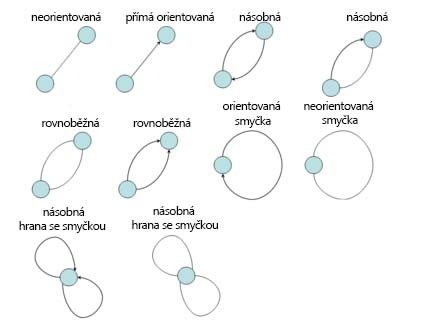
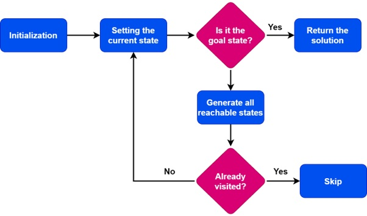
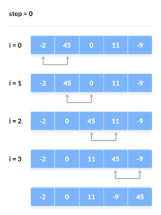
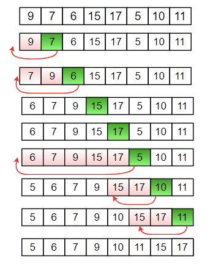
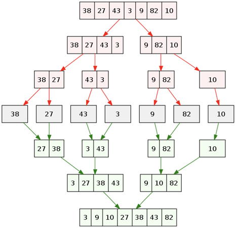
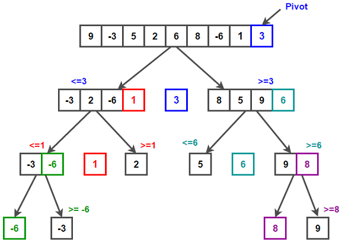

# [Algoritmizace - Grafy, prohledávání stavoveého prostoru, Řazení](https://youtu.be/vFEVHWnqLEo?si=nhnVlgqYUSbJKds1)

## O čem mluvit?
- [Grafy](https://ksp.mff.cuni.cz/encyklopedie/grafy/)
    - Využití
    - Hrany, Vrcholy
    - Typy:
        - Orientovaný / Neorientovaný
        - Hodnocený / Nehodnocený
        - Úplný / Neúplný
        - Cyklický / Strom
- [Prohledávání stavového prostoru](http://zuzka.petricek.net/vyuka_2019/ZALG_201920/cv8.pdf)
    - K čemu je stavový prostor?
    - Je to množína všech možných konfigurací
    - BFS / DFS
- Řazení
    - K čemu je dobré?
    - Řadící algoritmy
        - porovnávání na základě časové složitosti

## Grafy
- graf je datová struktura popisující vztahy mezi objekty
- slouží k zobrazení různých problémů v programování
- grafy z oblasti teorie grafů mají široké využití v mnoha oblastech, např. úlohy o dopravních spojení, logistické problémy, optimální spojení, propustnost sítě, přenos energie, komprese dat
- každý graf obsahuje:
    - Body = vrchol grafu (uzly)
    - Linie = hrany graf

- Typy hran:



*Pozor na pidimidi sipky*

## Typy grafů
#### Orientoaný
- Obsahuje hrany s definovaným směrem
    - hrany mají šipky označující směr procházení
- Hrany mají počáteční a koncový vrchol
- Např. graf webové stránky, kde jsou odkazy mezi stránkami

#### Hodnocený
- Má hrany nebo vrcholy, které jsou přiřazeny s hodnotami nebo váhami
- Můžou představovat například vzdálenost mezi vrcholy, náklady na cestu nebo jakoukoliv jinou informaci
- např.: graf silnic, kde hodnoty mohou představovat vzdálenost mezi dvěma městi.

#### Nehodnocený
- Nemá váhy nebo hodnoty přiřazené hranám nebo vrcholŮm
- např.: graf sociální sítě, kde hrany představují přátelství

#### Úplný
- Obsahuje všechny možné hrany mezi všemi vrcholy
    - Každý vrchol je přímý soused každého jiného vrcholu
- např.: graf turnaje, kde každý hráč hraje proti každému jinému hráči

#### Neúplný
- Nemusí mít všechny možné hrany mezi vrcholy
- Může obsahovat pouze určité hrany, které spojují určité páry vrcholů

#### Cyklický
- Obsahuje jeden nebo více cyklů
    - Sled vrcholů a hran, který začíná a končí ve stejném vrcholu
- Mužu projíř celý ten graf
- např.: graf sdílení kol, kde cykly představují trasy, po kterých kola jezdí

#### Strom
- Spojený graf bez cyklů
jdu shora dolů
např.: Rodinný strom, kde je každá osoba spojená se svými rodiči

## Prohledávání stavového prostoru
- Základní technika v umělé inteligenci
- stavový prostor je graf všech možných stavŮ
- používá se k nalezení cesty nebo řešení problému v grafových strukturách nebo stavových prostorech za účelem nalezení požadovaného stavu
- např.:
    - Všechny možné stavy při hře piškvorek (Všechny možné kombinace zaplnění hracího pole)



#### Prohledávání do šířky - BFS
- Breadth-First Search
- Pro ukládání navštívených vrcholů používá frontu (FIFO)
- Prohledává stavový prostor postupně do hloubky
    - postupuje z počátečního stavu do všech jeho sousedních stavů, poté do sousedních stavů těchto sousedních stavů atd.
- Vhodné pro hledání nejkratší cesty v nehodnocených grafech a prohledávání v grafech s konstantním nákladem na hrany

Python:
```python
'''
Graf:
  A
/ | \  
B C D  
| | |  
E F G
'''

graph = {
    'A': ['B','C','D'],
    'B': ['A','E'],
    'C': ['A','F'],
    'D': ['A','G'],
    'E': ['B'],
    'F': ['C'],
    'G': ['D']
}

def bfs(graph,start):
    visited = set()
    queue = [(start, 0)]

    while queue:
        node, depth = queue.pop(0)
        if node not in visited:
            print (f"{node} : {depth}")
            visited.add(node)
            for neighbor in graph[node]:
                queue.append((neighbor, depth+1))

bfs(graph, 'A')
# Output: A(0), B(1), C(1), D(1), E(2), F(2), G(2)
# A je objekt/stav, číslo je hloubka
```
#### Prohledávání do hloubky - DFS:
- Depth-First Search
- pro ukládání navštívených vrcholů používá stack (LIFO)
- prohledává stavový prostor do hloubky
    - prochází co nejhlouběji do stavů, než se vrátí a prozkoumá další stavy.
- vhodný pro hledání všech cest v grafu, řešení problému s rekurzivní povahou a prohledávání v grafech s velkým větvícím faktorem

## Řadící algoritmy
- řadící algoritmus je algoritmus zajišťující uspořádaní dané sady (typicky pole) do pořadí
- nejvýkonnejší algoritmy bývají zpravidla ty, které neporovnávají jednotlivé hodnoty prvků
- existují algoritmy stabilní a nestabilní
    - u stabilního nehrozí, že by v jeho průběhu byly prohozeny stejné hodnoty


##### Bubble sort
- stabilní
- časová složitost: O(n^2) *n je počet prvků*
- paměťová složitost O(1) - Používá konstantní množství paměti
- po dokončení je na začátku pole nejvyšší a na konci nejnižší hodnota
- porovnává vždy 2 sousední prvky
    - Pokud je nižší prvek nalevo od vyššího, prohodí je a pokračuje k dalšímu indexu
    - pokud jsou čísla správně (nižší napravo od vyššího), pokračuje k dalšímu indexu bez úpravy

Python:
```python
list = [0, 5, 3, 99, -2, 1]

def bubbleSort(list):
    for i in range (len(list)):
        for j in range (len(list) - i - 1):
            if list[j] > list[j+1]:
                list[j], list[j+1] = list[(j+1)], list[j]

# časová složitost je n na 2 (protože 2 for cykly v sobě)

bubbleSort(list)
```


#### Insertion sort
- nestabilní 
- časová složitost O(n^2) *n je počet prvků*
    - O(n) je v nejlepším případě, když je pole téměř seřazeno
- paměťová složitost: O(1) - jako bubble
- prvky se řadí na základě již projetých prvků


#### Merge sort
- stabilní
- "rozděl a panuj"
- časová složitost: O(n * logn) *n je počet prvků*
- paměťová složitost: O(n) - potřebuje pomocné pole stejné velikost jako pole řazení
- metoda slévání
- průběh: 
    - Pole se dělí na (přibližně nebo) stejně velké části dokud nejsou rozděleny na jednotlivé prvky
    - začne slévání: porovnáváním prvků a vedlejších polí
    - sousední prvky se porovnávají a slévají do jednoho pole dokud nezbyde jen jedno pole


#### Quick sort
- nestabilní
- časová složitost: O(n^2) *n je počet prvků*
    - O(n log n) v lepším případě
    - Nejhorší je když je pivot vybírán nevhodně a pole je téměř seřazené nebo seřazené v opačném pořadí
- paměťová složitost: O(log n)
    - O(1) - může pracovat bez použití další paměti: při každé iteraci, během procesu rozdělování, jsou položky nakonec prohozeny tak, aby byly v levém a pravém oddílu na základě použitého pivotu

- základní myšlenkou je rozdělení řazené posloupnosti čísel na dvě přibližně stejné části

