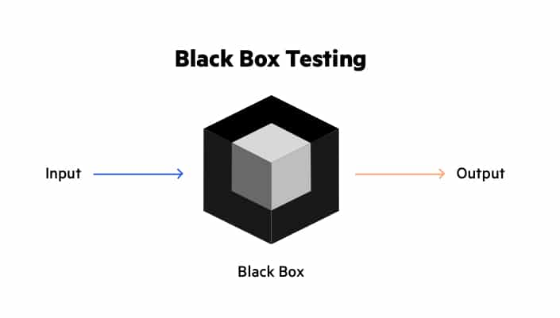

# [Testování, Unit testování a dokumentace zdrojového kódu](https://youtu.be/8X5PS8CZyIs?si=cg49xrzwNqY5VgCP)

## O čem mluvit?
- Testování
  - Důležitá soušást vývoje
  - Testujeme chtěné výsledky s těmi reálnými
  - Testcasy, unittesty
- **Unit testování:**
  - Testují nejmenší testovatelnou jednotku kódu jestli funguje sám o sobě
- **Dokumentace zdrojového kódu:**
  - Důležitost a výhody dokumentace zdrojového kódu pro udržitelnost a spolupráci v týmu.
  - Představení různých stylů dokumentace zdrojového kódu (např. docstring, komentáře, README soubory)
  - Ukázka psaní kvalitní dokumentace zdrojového kódu pomocí populárních konvencí a nástrojů

## Testování
- Důležitá součást vývoje
- Proces při kterém porovnáváme očekáváné výsledky s těmi reálnými
- Testování napomáhá při objevování potencionálních chyb
  - "Jak mohu tento kód rozbít?"
- Proces testů
  - Plánování testů
    - Plán co bude a jak testovat
  - Analýza a příprava
    - Např. psaní unit testů, příprava programu a testů
  - Vykonání testů
    - Spuštění (unit) testů a sledování výsledků
    - Vyhodnocené testů

#### Co testujeme? - Kvalitu (FURPS)
- **Functionality** - Správné chování systému a funkcí
- **Usability** - Zda jde program použít na to co jsme chtěli a je použitelný uživateli
- **Reliability** - Zda se chová (i při přetížení) tak jak má a nedochází k chybám (Umí chyby hlásit)
- **Performance** - Jestli je systém rychlí a zvládne to co má a nebere moc zdrojů
- **Supportability** - Instaluje se lehce? Funguje na HW a SW jakém má?

### Dělení testování
#### Typy testů
- **Unit Testy**
  - Testují nejmenší testovatelnou jednotku kódu
  - Ověřují, zda se chová správně, nezávisle na ostatních částech systému
  - Pokud nalezneme v Unit testu bug, funkci opravíme a používáme Regression testing
  - Kontroluje, zda opravení bugu nevytvořilo nové chyby ve zbytku kódu
  - Pokud ano, vracíme se k **Unit testingu**
- **Modul Testy**
  - Testují celé funkční moduly kódu
  - Ověřují, zda spolupracují správně s jinými moduly
- **Integrační testy**
  - Testují interakci mezi růžnými komponentami nebo moduly
  - Ověřují zda spolupracují správně
- **Testy komponent**
  - Testují celé funkční komponenty systému
  - Ověřují, zda pracují správně při interakci s ostatními komponentami
- **Funkční testy**
  - Testují, zda systém splňuje specifikovaně funkční požadavek
- **Systémové testy**
  - Testují celý systém jako celek
  - Ověřuje, zda splňuje požadavky a funguje správně v prostředí, kde bude nasazen
- **Akceptační testy**
  - Testují, zda systém splňuje požadavky a funguje správně v prostředí, kde bude nasazen

#### Dle znalosti kódu
**Black box testování**
- Blackbox, protože nevidíme dovnitř


```python
    def sqrt(x, eps):
        """
        :param x more or eq to 0
        :param eps more than 0 
        :return res such that x=eps <= res*res <= x+eps
        """
```

  <table>
    <tr>
      <th>CASE</th>
      <th>x</th>
      <th>eps</th>
    </tr>
    <tr>
      <td>boundary</td>
      <td>0</td>
      <td>0.0001</td>
    </tr>
    <tr>
      <td>perfect square</td>
      <td>25</td>
      <td>0.0001</td>
    </tr>
    <tr>
      <td>less than 1</td>
      <td>0.05</td>
      <td>0.0001</td>
    </tr>
    <tr>
      <td>irrational square root</td>
      <td>2</td>
      <td>0.0001</td>
    </tr>
    <tr>
      <td>extremes</td>
      <td>2</td>
      <td>1.0/2.0**64.0</td>
    </tr>
    <tr>
      <td>extremes</td>
      <td>1.0/2.0**64.0</td>
      <td>1.0/2.0**64.0</td>
    </tr>
    <tr>
      <td>extremes</td>
      <td>2.0**64.0</td>
      <td>1.0/2.0**64.0</td>
    </tr>
    <tr>
      <td>extremes</td>
      <td>1.0/2.0**64.0</td>
      <td>2.0**64.0</td>
    </tr>
    <tr>
      <td>extremes</td>
      <td>2.0**64.0</td>
      <td>2.0**64.0</td>
    </tr>
  </table>

- Testy vytváříme na základě specifikací a požadavků, které o funkci víme, nikoliv na základě kódu samotného
  - Black box testy budou vždy fungovat nehledě na to, jak někdo dannou funkci implementuje
    - Pokud ji samozřejmě implementuje podle danných specifikací
- Rysy
  - Nezávislost na vnitřní implementaci (na programování)
  - Založeno na specifikacích a požadavcích
### **Glass box testování**
Příklad:
```python
    def abs(x):
        """Assumes x is an int
        Returns x if x>=0 and -x otherwise """
        if x < -1:
            return -x
        else:
            return x
```

- Path complete může přejít chybu
- Path complete je v tomto případě `2` a `-2`
- Ale `abs(-1)` nesprávně vrací `-1`
- Musíme zkontrolovat i boundary cases (`-1`)

- Narozdíl od blackbox testování používáme samotný kód
- Path complete test je test Case, který prochází každou možnou cestou v kódu
- Problém přichází u cyklů
  - "Kód neprojde cyklem ani jednou"
  - "Kód projde cyklem jednou"
  - "Kód projde cyklem dvakrát"
  - ...
  - Možnost velmi velkého testu
- **Pravidla glassbox testování**
  - **Větvení**
    - Musíme mít test case, který prochází všechny možné větve
  - **Cykly**
    - Musíme mít test case, který
      - Neprochází cyklem
      - Prochází cyklem
        - Jednou
        - Vícekrát
      - **While cykly**
        - Stejně jako ostatní cykly
        - Test casy, které zachycují všechny možné způsoby opuštění cyklu

## Dokumentace zdrojového kódu
- **Důležitost dokumentace**:
- Dokumentace zdrojového kódu je klíčová pro porozumění funkčnosti, použití a účelu jednotlivých částí kódu.
- Dobrá dokumentace zjednodušuje údržbu, rozvoj a spolupráci v týmu, protože umožňuje rychlejší a snažší orientaci ve zdrojovém kódu.
- **Typy dokumentace**:
- **Docstring**: Jsou to řetězce umístěné na začátku funkce, třídy nebo modulu, které popisují jejich účel, vstupy, výstupy a použití.
- **Komentáře**: Jsou to poznámky v kódu, které vysvětlují určité části kódu, složitější algoritmy meno zvláštní přístupy.
- **README soubory**: Jsou to textové soubory umístěné v kořenoveém adresáři projektu, které poskytují přehled o projektu, instrukce pro instalaci a použití, a další důležité informace.
- **Kvalita Dokumentace**:
- **Jasnost**: Dokumentace by měla být jasná, stručná a snadno srozumitelná pro čtenáře
- **Relevance**: Dokumentace by měla obsahovat pouze relevantní informace související s funkcí třídou nebo modulem.
- **Aktualizace**: Je důležité udržovat dokumentaci aktuální a synchronizovanou s aktuálním stavem kódu.
- **Konvence a standardy**:
- Je vhodné dodržovat konvence a standardy psaní dokumentace definované v rámci projektu nebo komunity (např. PEP 8 pro python)
- Konzistentní používání formátování a stylu dokumentace usnadňuje čtení a porozumění kódu.
- **Nástroje pro generování dokumentace**:
- Existuje mnoho nástrojů, které umožňují automatické generování dokumentace z docstrings (např. Sphinx pro Python).
- Tyto nástroje umožňují vytvářet rozsáhlou a dobře strukturovanou dokumentaci zdrojového kódu s minimálním úsilím.
Příklad:
```python
def factorial(n):
    """
    :param n is an non negative integer.
    :return factN The factorial of n
    :raise ValueError If n is negative
    """

    if n < 0:
        raise ValueError("Factorial is not defined for negative numbers.")
    elif n == 0:
        return 1
    else:
        factN = n * factorial(n - 1)
        return  factN
```