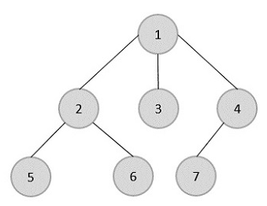
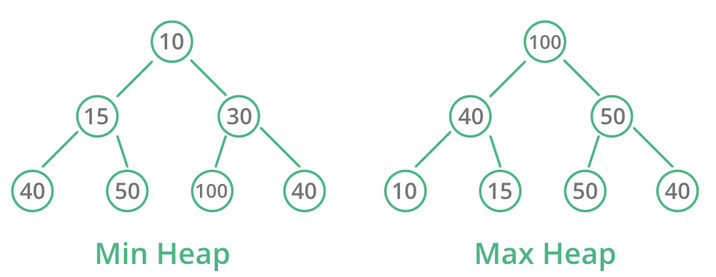

# [Typy datových struktur - Pole, Spojový seznam, Strom, Fronta, Zásobník, Halda](https://youtu.be/aEObhZafNgU?si=P6qXSro2iNYWajby)

## O čem mluvit?
- Vysvětlit obecně, co to jsou datové struktury
- Popsat Pole, jak je uloženo
- Popsat Listy, jak jsou implementované pomocí polí
- Popsat Linkedlist jeho vlastnosti a druhy, výhody a nevýhody
- Popsat Stromy, jak fungují, co je to binární strom
- Popsat Haldu, jaké podmínky musí splňovat
- Popsta frontu a stack, hlavní metody obou, čím se liší

## Pole / Array
- Jednoduchá datová struktura, představuje počet prvků seřazených v paměti
- Má neměnnou velikost, nedá se rozšiřovat ani zmenšovat, po celou doub existence zabírá stejné množství místa
- K prvkům přistupujeme pomocí indexu, většinou jsou prvky indexované od 0, až na některé jazyky
## ArrayList / List / Pole s variabilní velikostí
- Abstrakce nad polem, kde se velikost může měnit
- Funguje tak, že v případě potřeby vytvoří nové pole s novou velikostí a nakopíruje do něj data ze sterého
- Často se list jen zvětšuje a nikdy se nezmenšuje
## Spojový seznam / Linked List
- Datová struktura, ve které se data ukládájá ve samostatných objektech, které zároveň odkazují referemcí na další objekty
- Výsledkem je spojený seznam prvků, které ale mohou být rozházené na různých místech v paměti
- Výhoda je, že přidání nové nody, je velmi rychlá operace, co zabírá konstantní čas
- Nevýhoda je, že získání prvků je pomalé
  - Pro získání např. 20. prvku musíme projít všech 19 předchozích, než se k němu přes reference prokoušeme
- Mohou být **Single-Linked** či **Double-linked**
  - V Single-linked prvky odkazují jen na další prvek
  - V Double-linked prvky odkazují na další i předchozí prvek
- Prvnímu prvku se říka **head**, poslednímu se říká **tail**
- Pro implementaci potřebujeme vytvořit 2 třídy
  - **LinkedList** = Třída, která obsahuje metody s operacemi s kolekcí, odkazuje na head
  - **Node** = Třída pro samostatné prvky, obsahuje hodnotu a odkaz na další (a případně předhozí) prvek

## Strom / Tree
- Datová struktura podobná linked listu, akorát každý prvek může odkazovat na několik prvků
- Můžeme si ho představit jako hodnocený graf s několika pravidly
- Vrchnímu prvku se říká **root** (kořen), a prvkům na nejspodnější vrstvě se říká **leaf** (list)
- U prvků popisujeme vztahy mezi rodiči a potomky
- Stromy mají hloubku podle toho jak moc je prvek vzádelný od rootu, např. strom na obrázku má hloubku 3

- Častým druhem stromu je **binární strom**
  - Prvky mohou mít vždy buď 0, nebo přesně 2 potomky
- Stromy často slouží pro reprezentaci stavového prostoru
  - Prohledávání stavového prostoru se dělá přes BFS a DFS, více ve grafech

## Halda / Heap
- Speciální druh binárního stromu, který splňuje podmínky
  1. Jedná se vždy o kompletní binární strom, každý prvek musí mít dvě děti, až na poslední prvek, který nemusí být zcela zaplněn, a tak může mít í 1 dítě
  2. Haldu vždy zaplňujeme z leva do prava
  3. Hodnoty potmků rodiče musí mít vždy větší nebo menší hodnotu než rodiče podle typu haldy
- Typy haldy:
  - **Min-Heap**: Potomci mají vždy větší hodnotu než rodič
  - **Max-Heap**: Potomci mají vždy menší hodnotu než rodič

## Fronta / Queue
- Datová struktura s rozšířítelnou velikostí
- Pracuje na FIFO (First in, Frist out) principu, což znamená, že prvky které byly do fronty přidány nejdříve z ní také nejdříve vyndáme
- Klasicky máme 2 hlavní metody
  - **Enqueue** = Zařadí prvky do fronty
  - **Dequeue** = Odstraní prvky z fronty
- Může být implementovaná jako list či linked list, záleží na potřebách a jazyce
- Konci fronty se říká tail nebo rear, začátku se říká head nebo front

## Zásobník / Stack
- Datová struktura s rozšířitelnou velikostí
- Pracuje na LIFO (Last in, First out) principu, což znamená, že prvky které byly do zásobníku přidány nejpozději z nejdříve odejdou
- Hlavní metody:
  - **Push** = Přidá prvek do zásobníku
  - **Pop** = Získá hodnotu vrcholu a odtraní ho
  - **peek** = Vrátí hodnotu vrcholu, ale neodstraní ho
- Může být implementovaný jako list, či linked list, záleží na potřebách a jazyce
- Zásobník má vrchol (poslední přidaný prvek) a spodek (první přidaný prvek), top/bottom nebo také dom/sub