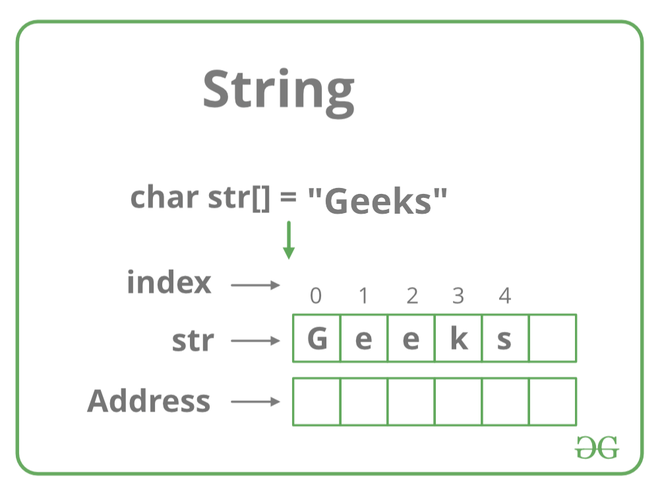

# [Zpracování a parsování textových dat, regulární výrazy, kódování a stringy](https://youtu.be/n74uts2mz6s?si=QRnqaFWBCSdHzCLX)

## O čem mluvit?

- Parsování textu
  - Syntatická analýza textu
  - Nejčastější metoda parsování = regex
  - Příklady parsování dat (logy, uživatelský vstup, soubory..)
- Regulární výrazy (Regex)
  - Co to je?
- Kódování
  - Speciální znaky - New line, backspace, tab...
  - ASCII
  - UNICODE
  - UTF
- Stringy
  - Co to je?
  - Built in metody
  - Implementace stringu
  - Proč je immutable?

## parsování textu
- = Syntatická analýza textu
- Převedení dat z určitého formátu do jiného (použitelnějšího) formátu
- Vyhledávání v textu
  - Např.: **C#**: převedení "čísla" na int
    - ```python
      cisloString = 50
      cisloInt = int(cisloString)
      ```
    - Používá se například u kalkulačky, kde uživatel zadá čísla ve formě textu a aby mohlo být číslo použito v příkladu tak je nejdříve potřeba ho převést do int
## Regex
- Regulární výraz (**Reg**ular **Ex**pression)
- Textový řetězec, který slouží jako vzor pro hledání v jiném textovém řetězci
- <details>
  <summary><a>Regex Cheatsheet</a></summary>
  
	
</details>

### Příklad použití Regexu v C#:
#### Získání informace, zda regex najde match
```python
import re
pattern = r"\d+"
input_string = "There are 123 apples"

# Pomocí bool() výsledek převedeme na True/False
is_match = bool(re.search(pattern,input_string)) # re.search najde shodu kdekoliv v řetězci (vrací objekt nebo None)

print(is_match) # True
```

### Získání matches
```python
import re
pattern = r"\d+"
input_string = "There are 123 apples and 456 oranges"

# re.findall vrací rovnou seznam nalezených řetězců
matches = re.findall(pattern,input_string)

for match in matches:
    print(match) # 123 456
```

#### Záměna textu
```python
import re

pattern = r"\d+"
string_input = "Price: 100 USD"

result = re.sub(pattern, "200", string_input)
print(result)
```

### Rozdělování stringů
```python
import re

pattern = r"\d+"
string_input = "Split these words"

result = re.split(pattern, string_input)

for word in result:
    print(word) # Split These Words
```

### Kódování
- Způsob, jak upravit data na formu, kterou bude počítač schopný zpracovat
- Většinou se ke kódování používají přesně stanovené tabulky a znakové sady
  - (tzn. že i např. Morseovka je kódovaná)

#### ASCI
- Používá sedmibitovou tabulku, kde je každému písmenu v anglické abecedě a růžným dalším znakům přiřazeno nějaké číslo
- Využívá např. 0-127 bitů.
- např.:
  - Pro znak **A** je určen kód **41** (v 16 soustavě), a tedy *1000001* binárně
  - <details>
	   <summary><a>ASCII Tabulka</a></summary>
	   
</details>

#### UNICODE
- Přiřazuje každému znaku unikátní kód
- Podporuje všechny možné jazyky
  - ..., Texty, písmena včetně cyrilice, arabštiny, čínštiny a mnohem další.
- Má dvou-bytové kódování, čimž má možnost využít dohromady 65536 znaků

#### UTF
- Způsob kódování znaků do sekvencí bytů
  - Reprezentuje UNICODE znaky pomocí jedno nebo vícebitových sekvencí
- Znaky pod 128 jsou kódovány jako ASCII, znaky mezi 128-2047 jsou kódovány dvojicí bytů, 2048-65535 se kódují pomocí trojice bytů a cokoliv nad 65536 se kóduje pomocí více bajtů. je tedy proměnlivý počet bajtů.
- **UTF-8**
  - Používá proměnou délku znaku, od 1-4 (6) bajtů (8 - 16 (64) bitů)
- **UTF-16 a UTF-32**
  - Používají právě 16bitová (2 byty), resp. 32 bitová slova

#### Huffmanovo kódování
- Kód který převádí jednotlivé symboly původního textu a děla to co nejúspornějším způsobem
  - Výsledná délka zakódovaného textu je v nějakém smyslu nejmenší možná

##### Příklad
- Chceme zakódovat a zkomprimovat  ```AHOJ, JAK SE MAS, KAMARADE?``` Tato zpráva je dlouhá 27 znaků a obsahuje 13 různých symbolů.
- Následující tabulka udává jednotlivé znaky, jejich četnost a trviální kódování:

| Znak   | Četnost | Triviální kód |
|--------|---------|---------------|
| mezera | 4       | 0000          |
| ,      | 2       | 0001          |
| ?      | 1       | 0010          |
| A      | 6       | 0011          |
| D      | 1       | 0100          |
| E      | 2       | 0101          |
| H      | 1       | 0110          |
| J      | 2       | 0111          |
| K      | 2       | 1000          |
| M      | 2       | 1001          |
| O      | 1       | 1010          |
| R      | 1       | 1011          |
| S      | 2       | 1100          |

- Zpráva by se pomocí triviálního kódování zakódovala do následujícího řetězce:
- ```0011, 0110, 1010, 0111, 0001, 0000, 0111, 0011, 1000, 0000, 1100, 0101, 0000, 1001, 0011, 1100, 0001, 0000, 1000, 0011, 1001, 0011, 1011, 0011, 0100, 0101, 0010```
- Výpočtem zjistíme, že výsledná zpráva má velikost 108 bitů

## String
- Řetězec znaků (Chars) = pole znaků
  - To nám dovoluje na něj uplatnit funkce použitelné na pole
- String lze také definovat jako posloupnost znaků uložených v navazujících paměťových místech, která je ukončena speciálním znakem zvaným nulový znak **\0**
- String je **neměnný objekt (immutable)**
  - Po vytvoření instance objektu String jej není možné měnit
    - Třída sice obahuje několik metod, které by mohly vypadat, že objekt pozmění, ty ale vytvoří nový objekt a nahradí jim ten starý

#### Immutable
- **Immutable**
  - Hodnotu stringu **Nemůžeme** měnit po vytvoření
    - Nemohu hodnotu přepsat a musím udělat proměnnou znovu
  - Proč jsou Stringy immutable:
    - Lepší výkon
    - Lehčí práce s pamětí
    - Thread-Safe
  - Java, JavaScript, Lua, Python, ...
- **Mutable**
  - Hodnotu stringu **můžeme** měnit po vytvoření
    - Mohu přepsat hodnotu na jinou
  - C, C++, PHP, Ruby, ...



#### Typy
- **Konstantní:**
  - ```javascript
    const PI = 3.14;
    PI = 3; // Error
    PI = PI +12; // Error
    ```
- **Staticky alokovaný paměťový prostor pro řetězec**
  - ```sql
    CREATE TABLE test (desc VARCHAR(30)) -- Staticky alokovaná velikost textu na 30 znaků
    ```
- **Dynamicky alokovaný paměťový prostor pro řetězec:**
  - ```php
	  //PHP
	  $retezec = "Já jsem nějaký řetězec a můžu obsahovat všemožné znaky z ASCII tabulky jako %, =, ' a jiné, ale třeba i z tabulky UNICODE (např. ▒, ☼, ♪). Můžu mít libovolnou velikost a jsem reprezentován dynamicky, podle velikosti paměti.";
    
#### Built-In Metody (C# / PHP)
- **Length** / **len**
- ```python
  text = "Hello, World!"
  print(text)
  ```
- **Replace()**
- ```python
  text = "Hello, World"
  new_text = text.replace("World", "Universe")
  ```
- **Substring** / **Substr**
- ```python
  text = "Hello, World!"
  substring = text[7:] # Od 7. indexu do konce tzn. "Wolrd!"
  ```

- **ToUpper()** / **ToLower()**
- ```python
  text = "Hello"
  upper_case = text.upper() # HELLO
  lower_case = text.lower() # hello
  ```

- **Constains**
- V pythonu klasicky `if "World" in text:`

- **Concat**
- `Connection = "World" + " " + "Hello"`
- **Equals**
- `if text == text2`
- **Split**
- `slovo = text.split(",")`
- **Trim**
- `cisty_text - text_strip` Odstrani mezery
- nebudu psát příklady na všechny, nejsme retardi přeci + tech metod je stovky
