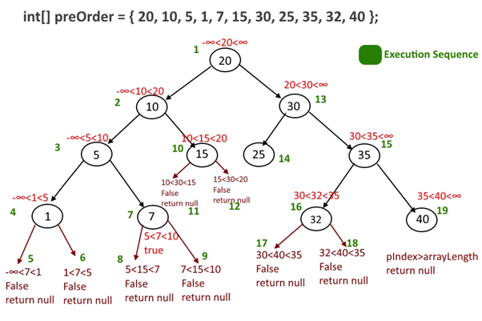
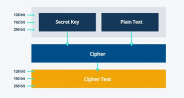
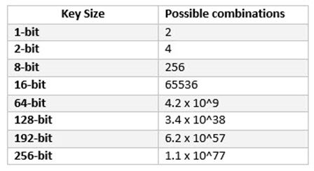

# [Algoritmizace - Rekurze, Brute Force, Heuristika, Nedeterministický algoritmy](https://youtu.be/wp_Zli_cgZw?si=sAHSumwAF2QL3NIx)

## O čem mluvit?

- Rekurze - *tu brát ze začátku teoreticky, pak až přejít na ukázku*
    - Objekt volá sám sebe
  - Využití
    - Typy rekurze:
      - Přímá / Nepřímá (volá sebe / volá b, b volá a)
      - Lineární / Stromová (Volá sebe / Volá jich víc)
- Brute Force - *ten téměř citovat*
  - Deterministický algoritmus
  - Používán na prolomení kódu
  - Časová náročnost je astronomická
- Heuristika
  - Zkusmé řešení problémů
  - Nevím jak se dostat k výsledku
  - Mohu díky tomu upřesnit např. Brute Force
- Deterministické vs Nedeterministické algoritmy - *tady nejde říct mnoho, je to **třešnička na dortu**
  - Deterministické = vždy stejný výsledek za stejných podmínek
  - Nedeterministické = vždy jiný výsledek za stejných podmínek

## Rekurze
- tj. když objekt je součástí sám sebe
- V programování je to prakticky cyklus
  - Procedura nebo funkce je zavolána znovu, než je dokončeno její předchozí volání
- U některých úloh to může vést k rychlému a efektivnímu řešení
  - Nemusí ale být optimální!!
- Pokud se snažíme program optimalizovat z hlediska paměti, rekurzi se snažíme omezit, či kompletně eliminovat

## Typy rekurze
- Rekurzi dělíme na dva základní typy na základě toho, kolik programů se jí účastní
#### Rekurze může probíat přímo nebo nepřímo:
- **Přímá rekurze** volá sama sebe, např. faktoriál
- **Nepřímá rekurze** je když vzájemné volání programu tvoří kruh
  - Příkladem je situace, kdy funkce A volá funkci B, která opět volá funkci A

#### Program může být volán jednou nebo vícekrát
- **Lineární rekurze** je když program při vykonávání svého úkolu volá sama sebe jen jednou
- **Stromová rekurze** je když se funkce v rámci jednoho vykonávání úkolu zavolá vícekrát. Struktura volání lze znázornit jako binární strom (viz obrázek)

Python:
```python
# Přímá lineární rekurze (A() -> A() -> ...)
def A():
    A()

# Nepřímá lineární rekurze (B() -> C() -> B() -> ...)
def B():
    C()

def C():
    B()

# Přímá stromová rekurze (D() -> 2*D() -> 2*D() -> ...)
def D():
    return D(), D()
```

Python:
```python
def factorial(n):
    if n == 0 or n == 1:
        return 1
    else:
        return n * factorial(n - 1)
```

## Brute Force
- Deterministický algoritmus
- Velmi rozsáhle používaný postup
- Obvykle slouží k prolomení hesla, či celých příhlašovacích údajů
- Proces je automatizován

#### Časová komplexnost
- Čas potřebný k prolomení hesla roste exponenciálně s délkou klíče
  - Uváděno v bitech (používají se 128 a 256)
  - Zvětšuje se s tím prostor klíče
- Velký prostor klíčů je tak nutno podmínkou pro bezpečnost šifry 
- K prolomení symetrického klíče o délce 256 bitů je zapotřebí 2128 krát vyšší výkon, než k prolomení 128 bitového klíče
  - Za předpokladů, že bychom disponovali strojem se schopností ověřit trilion (1018) klíčů za sekundu stále by dešifrování trvalo 3x1051 let

Python:
```python
key_to_discover = 800815

def discover_key(key):
    try_key = 0
    while True:
        if try_key == key:
            print(f"Key discovered! -> {key}")
            break
        else:
            try_key += 1

# Extrémně simplifikovaný příklad, ale v jádru jde o to samé, pokus-omyl algoritmus = zkouší všechny možné kombinace, dokud nenalezne to co hledá
```




## Heuristiky
- Heuristika je vlastně zkusmé řešení problémů
- Obvykle označení pro algoritmy, které:
  - Neposkytujou záruku kvalitu řešení - získáme ho ale rychle
  - Pokud nevíme, jestli heuristika uspěje
- Dokáží zrychlit BruteForce, upřednostňují nějaké řešení a nějaké i vynechají
- Vhodné tehdy, pokud neznáme přesný postup jak dojde k cíli
  - Toto řešení nemusí být ale dostatečně přesné
    - např.: rozhodnutí bota v šachách

#### Nejčastější metody Heuristiky:
- **Generický algoritmus**
  - Algoritmus založený na principu přirozeného výběru
  - Na základě předem daných kritérií rozhoduje, jakou hodnotu upřednostní
  - Dokaže najít kvalitní řešení i složitého problému, v oblasti IT je velmi rozsáhle používané
- **Metoda lokálního hledání**
  - tyto metody vyhodnocují jen své nejbližší okolí a vydají se při prohledávaní zkrátka nějakým směrem, který se v tu chvíli zdá metodě lokálně optimální na základě vyhodnocení funkce
- **Iterativní metoda**
  - Využívá postupného hledání řešení ve stále se zúžující oblasti řešení
  - Postupně se z dobrého řešení dopracovává k ještě lepšímu řešení

## Deterministický / Nedeterministický algoritmy
#### Deterministické
- Za stejných podmínek vrátí vždy ten stejný výsledek
#### Nedeterministický
- Za stejných podmínek **ne**vrátí vždy stejný výsledek
- např. MonteCarlo, hod kostkou
- RNG není úplně nedeterministický (generuje ho procesor, stroj z křemíku, nebo se generuje podle času/tlaku v atmosféře, ..., takže by se dalo velmi složitě předpokládat) ale bude se u maturity brát jako nedeterministický