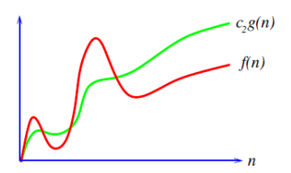
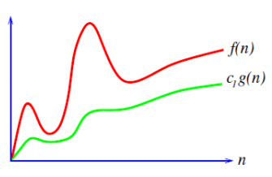
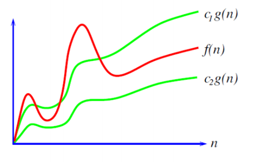

# [Asymptotické paměťové a časové složitosti](https://youtu.be/zojej6FYgYQ?si=Gn2t4RPM3-uLhTYD)

## O čem mluvit?
- Určujeme jak dlouho času a kolik paměti zabere vykonat nějaký úkon
- Způsoby klasifikace
  - Big O, Theta, Omega
- Která složitost je přijatelná a co už je moc? (Konstantní, logaritmická, lineární...)
- Časová / Paměťová
  - Příklady u různých algoritmů
    - Výhody, nevýhody
    - Vzájemná kompenzace
    - Analýza požadavků na konkrétní problém
- Jak analyzovat složitost?

## Asymptotická složitost programu
- Způsob klasifikace určitého programu
  - Algoritmus je přesně daný postup, jak vyřešit určitý problém
- Způsob, kterým se dá určit kolik prostředků bude potřeba k dosažení cíle
  - Asymptotická, protože se zabývá výkonností u programu, který může pracovat s neomezeným počtem dat
- V základu se rozděluje na **časovou** a **paměťovou**
- Je důležité zmínit, že jiné zařízení mají jiné parametry
  - Tím pádem se výsledek bude lišit na různých zařízeních
  - Tyto složitosti rozlišujeme tím, jak doba vykonání roste se změnou  množství dat

#### Klasifikace
- **Big O** [big O]
  - Nejpoužívanější
  - Určuje nejhorší možný případ složitosti (horní mez)
  
- **Big Ω** [big omega]
  - Určuje nejlepší možný případ složitosti (dolní mez)
  
- **Big Θ** [big théta]
  - Určuje složitost ve vymezených hranicích
  - tzn. že reálně se bude lišit od perfektní složitosti maximálně ve vymezených limitách (průměr)
  

## Asymptotická časová složitost
- Time Complexity
- Určuje dobu, kterou procesor vyžaduje k vykonání úlohy
  - (Počítá se s tím, že máme neomezenou paměť)
  
## Typy
- **Konstantní - 0 (1)**
  - Konstantní složitost nám říká, že na počtu dat nezáleží
  - Algoritmus bude trvat stále stejně ř
  - říká se mu také dokonalý / perfektní algoritmu n
    - Ale ne pokud bude trvat i tak pět let
  - např.: Skok na index v poli
    - Je jedno, kolik bude prvků, první bude vždy 1., osmý vždy 8.
```python
pole = [1,2,3,4]
print(pole[2])     
```

- **Logaritmická - 0 (Log n)**
  - Rozděl a panuj
    - (nedělí tak dlouho dokud nezůstanou jen dvojice na rozdíl od Linearitmetické)
  - Algoritmus se rozdělí prvky jak potřebuje
  - např.:
    - Hledání jména v telefoním seznamu
      - Nemusíme kontrolovat každé jméno, když víme, že příjmení začíná na určité písmeno
      - Rozdělíme seznam na polovinu a zjistíme, v jaké polovině leží toto jméno
- **Odmocninová - Θ (√n)**
  - Prohledávání prvků v **k** - dimenzionálním stromu
- **Lineární – Θ (n)**
  - Složitost kde pro 10 prvků se provadí 10 operací, pro 100 operací atd
  - např.
    - Vypsání všech prvků v poli, tolikrát, kolik je prvků
      - Pokud se 100.000 vypíše za sekundu, 1.000.000 (MIL) se vypíše za deset sekund
    - ```python
      pole=[1,2,3,4]
      for p in pole:
        print(p)
      ```
      
- **Linearitmická Θ (n * log n)**
  - Rozděl a panuj
    - Vezme nesetříděný pole a dělí je na poloviny tak dlouho, dokud nejsou pouze dvojice
    - Následně dvojici seřadí a poté všechny dvojice spolu s další dvojicí spojuje, tak dlouho, dokud nemá celé pole
  - např.:
    - [Merge sort](02%20-%20Algoritmizace%20-%20Grafy,%20Prohlédávání%20stavového%20prostoru,%20Řazení####%20Merge%20sort) a [Quick sort](02%20-%20Algoritmizace%20-%20Grafy,%20Prohlédávání%20stavového%20prostoru,%20Řazení####%20Quick%20sort)
- **Kvadratická – Θ (n²)**
  - Složitost je kvadratická - *("v sortingu"):* pro sedm prvků, sedmkrát proběhne sedm míst
    - Projíždí i ty prvky, u kterých si je jistý, že jsou seřazené na konci správně
  - např.:
    - [Bubble Sort](02%20-%20Algoritmizace%20-%20Grafy,%20Prohlédávání%20stavového%20prostoru,%20Řazení####%20Bubble%20sort) a [Insertion sort](02%20-%20Algoritmizace%20-%20Grafy,%20Prohlédávání%20stavového%20prostoru,%20Řazení####%20Insertion%20sort)
    - Dva for-cykly v sobě
    ```python
    pole = [1,2,3,4]
    for p in pole:
        for pp in range(len(pole)):
            print(pp)
    ```
- **Faktoriálové  – Θ (n!)**
  - Řešení čehokoliv pomocí hrubé síly - - [Brute force](03%20-%20Algoritmizace%20-%20Rekurze,%20Brute%20Force,%20Heuristiky,%20Nedeterministické%20algoritmy##%20Brute%20force)
  - Na grafech udáváme vždy jako nejhorší možnost
    - (I když existuje ještě horší)
  - např.:
    - řešení problémů obchodního cestujícího
      - Postupně projdeme absolutně všechny kombinace cest, které existují, a poté vybereme tu nejsnažší
## Asymptotická paměťová složitost
- Space / Memory Complexity
- Určuje kolik operační paměti bude využito
- Častá chyba je, že si někdo může říct, že paměťovou složitost nelze rozlišit, protože na různých zařízených bude využívat stejné množství pamětí, což sice je pravda, ale stále ji můžeme rozlišit
- A rozlišit ji můžeme naprosto stejně jako u časové, akorát se změní otázka na **jak paměť vykonání roste se změnou množství dat**

#### Typy
- **Konstantní - Θ (1)**
  - S pamětí se nic neděje, využíváme stále to stejné množství/obsah
  - např.:
    - for-cyklus, kde tiskneme „i“ 
      - V tomto případě se totiž s pamětí neděje nic jiného, než že jsme jednou vytvořili proměnou i a neustále jí jen přepisujeme (Upravujeme její obsah) a tiskneme
    ```python
    pole=[1,2,3,4]
    for p in pole:
        print(p)
    ```
- **Lineární – Θ (n)**
  - např.:
    - Rekurzivní řešení faktoriálu
      - Pokud máme například faktoriál 6, je to 6x5x4x3x2x1 - Tudíž pro faktoriál šesti potřebujeme šestkrát uchovat největší hodnotu
    - ArrayList
      - jak ArrayList roste, roste i jeho potřeba pro paměť
    ```python
    pole=[1,2,3,4]
    pole.append(5)
    ```
- **Kvadratická - Θ (n2)**
  - např.:
    - 2D Array
    - Násobení matic