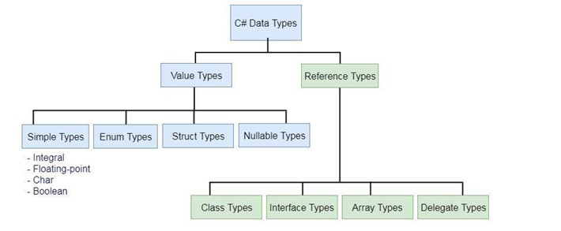

# [Datové typy, Generika, Výčtové datové typy, Struktury, Anotace, Operátory](https://youtu.be/aEObhZafNgU?list=PLmW7bUCTvOeTSag9ZZBYXdHs_iEwB4OHM)
*(Video prezentace není přímo na toto téma, ale dotýká se ho)*
- *Na tohle **Mandík** hodně apeloval, ať nezačneme mluvením o tom, že existuje int, string atd... Spíš je dobrý začít jak se dělí, kam se řadí a pak až nějak zmiňovat konkrétní typy*

## O čem mluvit?
- Datové typy a jejich rozdíly
  - Ordinální (primitivní)
    - int, char, bool, byte
  - Neordinální
    - string, float, double, real
  - Mutable a immutable (string)
  - null (prázdná hodnota)
- Generika
  - Obecný datový typ
  - např. V Listu (uživatel si zvolí co bude list držet)
  - Generická třída
- Výčtové datové typy (ENUM)
  - Když chceme mít na výber z fixních dat
  - Např.: dny v týdnu, měsíce, stavy
- Anotace
  - U unit testů
  - Popisuje IDE co je co
  - @override
- Operátory
  - Typy operátorů
    - Aritmetické +,-,*,/
    - Relační >,<,<=,>=
    - Logika and, or, xor
    - Ternární if
    - Přiřazovací (=)
  - Operator overloading

## Datové typy
- Definice hodnot, které smí proměnná nebo konstanta nabývat
- Součástí programovacího jazyka je definice základních datových typů
  - Pomocí těchto základních typů může ve většině jazyků můžeme tvořit nové složené typy




### Ordinální datové typy
- Tvoří lineární uspořádanou množinu
  - Pro každý prvek je přesně definovaný předchůdce i následovník
    -   (Z posledního prvku ve většině jazyků dochází k přetečení na první)
  - Z funkčního hlediska tak lze k jednoduchým celočíselným datovým typům řadit i výčtový typ, i když jeho hodnoty jsou definovány programátorem.
- Ordinální celočíselné datové typy jsou základem současné informatiky

#### Boolena (logická hodnota)
- **True** nebo **False** / **1** nebo **0**
- Některé jazyky ale neumí 1 a 0, např. Python a C to umí

Python:
```python
is_true = True
```

C:
```c
int is_true = 0

// Nebo:

typedef int bool;
bool is_true = true;
```

C#:
```csharp
bool is_true = true
```

#### Integer (celé číslo)
- Má určitý rozsah čísel
- Může přetéct
- Různé možnosti zápisu 0, 12 , -5661, 0xA9
- Programovací jazyk mohou (ale nemusí) rozlišovat celá čísla bez znaménka a se znaménkem
- Některé jazyky (napr. Python) místo přečtení pro číslo vyhradí větší množství paměti, tím je usnadněno programovaní, avšak snižuje se výkon programu
- Můžeme provádět matematické a logické operace mezi čísly, pomocí operátorů (+, -, *, /, <, >, \==, <=, >=), na složitější matematické operace se většinou využívají vlastní metody nebo knihovny (např. odmocniny)

Python:
```python
number = 16
neg_num = -32
```

C:
```c
int number = 16
int neg_num = -32
int hex_num = 0xA9
```

C#
```csharp
int number = 16
int neg_num = -32
```

#### Char (znak)
- Využívá se kódování (ASCII/Unicode), ve skutečnosti je znak v počítači reprezentován pomocí celého čísla
- Využit zejména na stringy

Python:
```python
character = 'a'
```

C:
```c
char ch = "$";
```

C#:
```csharp
char cha = '2';
```

### Neordinální datové typy
- Není jednoznačně určen předchůdce a následovník každé hodnoty

#### Float, Double, (for)Real (reálné číslo)
- Zápis čísla s tečkou podle anglosaské konvence (3.14)
- Nelze reprezentovat všechna čísla stoprocentně správně
- Reálná čísla se v počítači mohou chovat jinak, než by se intuitivně dalo čekat
- V počítači bývá většinou implementováno ve dvojkové soustavě jako _mantisa_ * 2^_exponent_, kde _mantisa_ a _exponent_ jsou celá čísla
- Zásadní výhodou reálných čísel je, že mohou ve stejné velikosti paměti reprezentovat mnohem větší rozsah hodnot, než celé číslo
- Cennou za vyšší dynamický rozsah je horší přesnost u velkých čísel (což často nevadí) a vyšší nároky na architekturu procesoru

- **Float**
  - 6 až 7 desetiných míst
- **Double**
  - Až 15 desetiných míst

Python:
```python
pi = 3.14
f = 1.45e3
r = float(2) # bude to 2.0
```

C:
```c
#include <stdio.h>

float f = 255.06f;
double d = 15.8989;
```

C#:
```csharp
float myNum = 5.75F;
double myDoubleNum = 5.99D;
```

#### Prázdný datový typ
- **void** - jedná se o specialitu jazyku C, tento typ nenabývá žádných hodnot, může sloužit mimo jiné pro deklaraci funkce, která nemá návratovou hodnotu, nebo označovat data nespecifikovaného typu
- v některých jazycích existuje rovněž prázdná hodnota ošetřující neplatný výsledek - _null_ nebo _nil_, která je vlastně součásně zvláštním datovým typem, výsledkem vetšiny operací s konstantou nil je opět nil, takže chování programu je deterministický

Python:
```python
nothing = None
def no_ret_fun():
    pass
```

C:
```c
// Využití hlavně v pointerech
#include <stdio.h>

int main(void) {
    int * p_some_variable = NULL;
    
    if (p_some_variable = NULL) {
        printf("equal");
    }
}
```

C#:
```csharp
string s = null;
```

#### Generika
- Nejjednoduší definice generik je **obecný datový typ**
- Když chceme dát uživateli volnost, aby si mohl vybrat libovolný dat. typ, používají se právě generika
  - Zejména se také hodí jako vstupní proměnné do metod či pro listy
- např.:
  - Běžně užíváme listy. Listy nemají předem nadefinovaný datový typ, ale používají generikum. Při vytváření listu, tak musíme přesně určit ve špičatých závorkách, co chceme ukládat
     ```csharp
      List<int> cisla = List<int>();
      List<string> stringy = new List<string>();
      List<bool> booleany = new List<bool>();
      ```
    Pro vytváření takové generické třídy se taktéž používají špičaté závorky. Třída pro práci s listem tak může vypadat třeba následovně:
  ```csharp
    class Genericka_trida<T> {
        List<T> listik;
    
        public Genericka_trida() {
            listik = new List<T>(); 
        }
    
        public void pridatPrvek(T prvek){
            listik.add(prvek);
        }
    }
    ```
  ```python
  from typing import TypeVar, List
  T = TypeVar('T')
  def process_items(items: List[T]) -> List[T]:
    return [item for item in items]
  result = process_items([1, 2, 3])
  print(result)
  ```
  - tzn. vytořil jsem si generickou třidu pomocí špičatých závorek u jména třídy a dále nějakou příkladnou ukázku použití - vlastní třída pro práci s listem.

  - Obecně nezáleží jaké písmeno do špičatých závorek zvolíme. Nejčastěji se používa T.

## Struktury
- Struktury jsou podobné třídám 
- Používají se pro ukládání menších kolekcí dat, přičemž žádná z jeho vlastností nesmí být referenční dat. typ Na rozdíl od tříd:
- **Nejsou referenční datový typ** Tzn. data se ukládájí přímo na zásobník => pokud nepot5ebujeme používat metody dané struktury
- Nemůže se změnit konstruktor, který nemá vstupní parametry

Python:
```python
# Nejsou, nepoužívají se v Pythonu (DOHLEDAT)
```

C:
```C
#include <stdio.h>

struct myStructure {
    int myNum;
    char myLetter;
};

int main() {
    struct myStructure s1;
    
    s1.myNum = 13;
    s1.myLetter = 'B';
    
    printf("My number: %d\n", s1.myNum);
    printf("My letter: %c\n", s1.myLettter);
    
    return 0;
}
```

C#:
```csharp
using System;
namespace CsharpStruct {
    
    struct Employee {
    public int id;
    
    public void getId(int id){
        Console.WriteLine("Exmployee Id: " + id)
       }
    }
    
    
    class Program {
        static void Main(string[] args) {
        
        Employee emp;
        
        emp.id = 1;
        
        emp.getId(emp.id);
        
        Console.ReadLine()
       }
   }
}
```

## Výčtové datové struktury
- Výčtové datové typy nefungují jako ty klasické
- Používáme je ve chvíli, kdy chce dát na výběr  z **pevně daných možností, které se nemění**
  - Neslouží tak pro dynamické ukládání hodnot, jako klasick proměnné.
- Nejpoužívanější je **enum**
- Příklady enum: dny v týdnu, měsíce, názvy levelů, stavy, atd.

Většinou se k jednotlivým hodnotám enum přiřazuje numerická hodnota (index)
Hodnoty enum se používají jako konstanty

Python:
```python
from enum import Enum

class Season(Enum):
    Spring = 1
    Summer = 2
    Autumn = 3
    Winter = 4
```

C:
```c
typedef enum {FALSE, TRUE} boolean;
typedef enum {Po, Ut, St, Ct, Pa, So, Ne} den;

boolean splneno = TRUE;
den streda = St;
```

C#:
```csharp
class Program
{
    enum Level
    {
        Low,
        Medium,
        Height
    }
    static void Main(string[] args)
    {
    Level MyVar = Level.Medium;
    Console.WriteLine(MyVar);
    }
}

-> Medium
```

## Anotace
- Dodání metadat k funkcím, proměným, třídám,...
- Poskytují dodatečně informace o jejich zamyšlením použití nebo chování. Anotace jsou obvykle používány kompilátory, interprety nebo jinými nástroji k uplatňování omezení, optimalizaci kódu nebo generování dokumentace.

Mohou sloužit k:
- Určení datového typu parametru funkce
- Typicky používáno v Javě, C#, atd kde je tato anotace nutná, ale může být použito i v Pythonu, GDScriptu jako doporučení, jaký typ má jít do funkce

Python:
```python
def say_phrase(phrase : str) -> str:
    return f"{phrase}"

# Anotace je ": str" indikující, že input má být string
```

Validační anotace k ověření vstupních parametrů zda nejsou Null

Serializační anotace k naznačení jak se má kód chovat při serializaci/deserializaci dat

Dokumentační anotace k automatické generaci dokumentace

Python:
```python
def add(a, b):
    """
    Add two numbers together
    
    :param a: first value
    :param b: second value
    :return: int value, of two numbers
    """
    return a + b
```

Existuje mnoho další anotací, python využívá jenom Docsrings, nástroje PyDocs (Nepovinné)
- Override
- Overload
- etc

## Operátory
- Symbol (nebo řada symbolů) využívaný k reprezentaci matematických či logických operací mezi proměnnými nebo hodnotami.
- Každý programovací jazyk má svojí škálů použitelných operátorů, základní operátory jako např. +, -, \*, /, bývají všude stejné.

## Aritmetické
- Používají se k základním matematickým operacím
- **Součet** +
- **Rozdíl** -
- **Součin** \*
- **Podíl** /
- **Modulo** % nebo *mod* (zbytek z dělení)

#### Relační
- Používají se k porovnávání dvou hodnot
- Nejčastější použití v **if**ech
- **Rovnost:** == nebo eq
- **Nerovnost:** != nebo ne
- **Větší než:** > nebo gt
- **Menší než:** < nebo lt
- **Větší rovno:** >= nebo ge/gte
- **Menší rovno:** <= nebo le/lte

#### Logické
- Logické operace AND, OR, atd...
- **Negace:** not nebo !
- **Konjunkce:** and nebo &&
- **Disjunkce** or nebo ||
- **Non-ekvivalence:** xor nebo ^

#### Ternární
- Zjednodušené: Zapsání if podmínky na jeden řádek

Python:
```python
if(12 == 12):
    print("yep")
else:
    print("nope")
# =>
(12 == 12) if print ("yep") else print("nope")
```

#### Přiřazení
- Snad nejpoužívanější z
- Používá se k přiřazení hodnoty k proměnné
- **Přiřazení:** =